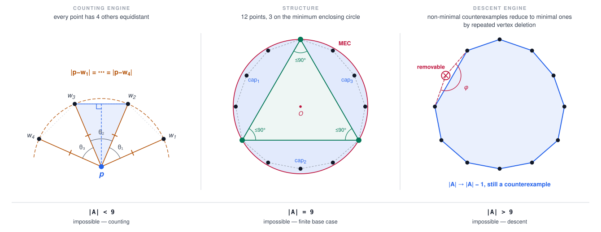

# Erdős Problems 97 & 96 — Lean 4 formalization

<picture>
  <source media="(prefers-color-scheme: dark)" srcset="docs/assets/p97-architecture-dark.svg">
  
</picture>

This repository is an attempt to prove two Erdős problems about convex point
sets in the plane, in Lean 4, against the canonical statements in
[`formal-conjectures`](https://github.com/google-deepmind/formal-conjectures).
**Neither problem is proved yet.** What follows is an honest account of how far
the argument has been carried, what is machine-checked, and what is still open.

Problem 97 asks whether a finite set of points in strictly convex position can
have the property that every point of the set has four others at a common
distance from it. Erdős conjectured it cannot. Problem 96 asks how many unit
distances `n` points in convex position can determine; the conjectured answer is
`O(n)`. The two are connected: a proof of 97 yields 96 with the explicit
constant 3, and that implication is one of the things fully proved here.

The proof strategy is a single strong induction on the size of a hypothetical
counterexample `A`, and the figure above is its skeleton. A counting engine —
a double count of isosceles configurations, in the style of Dumitrescu — shows
that any counterexample needs at least 9 points. A descent engine shows that any
counterexample with more than 9 points contains a *removable* vertex, whose
deletion leaves a strictly smaller counterexample and so contradicts
minimality. A finite base case rules out exactly 9 points by an explicit
geometric case analysis. Together those three would leave no room for a
counterexample at all.

Two of the three are finished and kernel-checked. The counting engine and the
`n = 9` base case are unconditionally proved, with axiom closure measured on
2026-08-18 as exactly `{propext, Classical.choice, Quot.sound}`. The descent
engine is where the work remains. Its hard core is the removable-vertex lemma,
which is assembled from a three-way split; two of the three branches are closed, and the third fans out
through a long sequence of case splits into an open frontier of **28
`sorry`-carrying leaf theorems** reachable from the publish target, all of them
in the `ATailFrontierLiveClosure` namespace under
[`P97/ATail/FrontierLiveClosure/`](lean/Erdos9796Proof/P97/ATail/FrontierLiveClosure).
Every one of those leaves is a statement of the form "this particular
combinatorial-geometric configuration is impossible". No leaf has been found to
be a restatement of the theorem or to be false, but no systematic per-leaf
non-vacuity audit has been recorded, so treat that as an absence of findings
rather than an established property. They are grouped in **Proof status** below.

A substantial amount of mathematics *is* finished here, and it is worth
separating from the open part. The best machine-checked lower bound on the size
of a hypothetical Problem 97 counterexample is `n ≥ 12`; the strongest such
bound that avoids compiler trust is `n ≥ 10`. A minimum enclosing circle
development, absent from mathlib, is built from scratch and includes the
classical boundary dichotomy for the problem Sylvester posed in 1857. Erdős 97 ⟹
Erdős 96 with constant 3 is proved outright — the implication itself is not new,
but the formal proof is. Twenty-four of these results are independently gated in
[`comparator/`](comparator/), which
restates each one in mathlib vocabulary alone and checks that this repository's
proofs discharge the restatement — so a reviewer can see exactly what is claimed
without trusting anything in this tree.

The frontier has grown since the 2026-08-07 README snapshot, which reported 21
open leaves, because later case splits replaced coarse obligations by sharper
ones. The 2026-08-23 D2 two-radius-grid formalization is the first closure in
the present TriApex campaign: it reduced the freshly mined frontier from 29 to
28, where it stands as of 2026-08-24. The consolidation refactor that followed
(Phases 0–1b, 2026-08-23/24) re-packaged the frontier modules and added a
generated obligation registry under [`proof-status/`](proof-status/) without
changing the roster or the axiom closure. The solver-assisted lanes — SAT,
CEGAR, PIQD, and the off-spine bank chain
— have separately produced a large body of finite checked artifacts; those
off-spine artifacts do not count as leaf closures until a kernel-connected
consumer uses them. Certificate banks already on the published import spine
have closed branches; the distinction is drawn under **The computational
lanes** below.

**This is the main repository where the proof is being closed.** The former
companion repository `p97-rvol` is historical as of 2026-07-06; its U-lane
route-B tail was imported here on 2026-07-05 and its status documents are
superseded by this one.

---

## Known `k = 3` witnesses

Problem 97 is the `k = 4` instance of "every point has `k` others equidistant
from it, in convex position". For `k = 3` the property **is** realizable, which
is what makes the `k = 4` case delicate rather than routine: any proof must use
something that separates 4 from 3. The counterexample-search lane
([`docs/p97-counterexample-search-design-2026-07-28.md`](docs/p97-counterexample-search-design-2026-07-28.md))
carries the two known witnesses as positive controls. In both figures each
dashed circle is centred at a vertex and passes through that vertex's three
equidistant witnesses.


Nine points with exact ℚ(√3) coordinates, threefold symmetry, and a witness
distance that **varies per vertex** (Danzer-style). The coordinates were
verified twice by independent exact arithmetic
(`scratch/p97-search-lane/verify_k3_control.py`; a second, independent check
was run outside the repository and is not committed). Note that `n = 9` is
exactly the counting engine's unconditional bound for a `k = 4` counterexample,
before the base case pushes the floor to 10.


The Fishburn–Reeds 1992 20-gon: a **single common distance** 1, every vertex's
three witnesses lying across a convex cut `{L, R}`, and `n = 20` proven minimal
for the cut-restricted version. Table-1 coordinates were transcribed and
numerically verified in `scratch/p97-search-lane/fishburn-reeds-notes.md`; exact
certification of the configuration is the realization arm's validation target
(`scratch/p97-search-lane/fr-certify/`). Plots:
`scratch/p97-search-lane/plot_k3_witnesses.py`.

---

## What is formalized

Two upstream-vocabulary theorems are exported. Each is *definitionally* the
right-hand side of the corresponding `formal-conjectures` statement, so building
this repository checks the proofs against the upstream definitions
(`Erdos97.*` / `Erdos96.*`), not a private restatement.

### Problem 97 — [`Problem97.erdos97_rhs`](lean/Erdos9796Proof/P97/UpstreamBridge.lean#L30)

> A convex-independent set of points in the plane cannot have the property that
> every point has 4 others equidistant from it.

```lean
theorem erdos97_rhs :
    ∀ A : Finset ℝ², A.Nonempty → EuclideanGeometry.ConvexIndep (A : Set ℝ²) →
      ¬ Erdos97.HasNEquidistantProperty 4 A
```

This is the RHS of upstream
[`Erdos97.erdos_97`](https://github.com/google-deepmind/formal-conjectures/blob/89a67be506fbae633d02941ccbd9f3737bbd5457/FormalConjectures/ErdosProblems/97.lean#L76)
(materialized under `lean/.lake/` from the rev pinned in `lake-manifest.json`).
The bridge [`Problem97.upstream_iff`](lean/Erdos9796Proof/P97/UpstreamBridge.lean#L22)
is `Iff.rfl`.

### Problem 96 — [`Problem96.erdos96_rhs`](lean/Erdos9796Proof/P96/UpstreamBridge.lean#L96)

> The maximum number of unit distances determined by `n` points in convex
> position is `O(n)` — here with explicit constant `3`.

```lean
theorem erdos96_rhs :
    (fun n => (Erdos96.maxConvexUnitDistances n : ℝ)) =O[atTop]
      fun n => (n : ℝ)
```

This is the RHS of upstream
[`Erdos96.erdos_96`](https://github.com/google-deepmind/formal-conjectures/blob/89a67be506fbae633d02941ccbd9f3737bbd5457/FormalConjectures/ErdosProblems/96.lean#L69),
obtained from the per-set bound `unitDistancePairsCount A ≤ 3 * A.card` for
convex `A`
([`unit_distance_pairs_bound`](lean/Erdos9796Proof/P96/EuclideanPeeling.lean#L289)).

---

## Proof status

**Both published claims still reach `sorryAx`.** Measured directly against a
built tree on 2026-08-24, at commit `4b1c21b8`:

```
'Problem97.erdos97_rhs' depends on axioms:
  [propext, sorryAx, Classical.choice, Lean.ofReduceBool, Lean.trustCompiler, Quot.sound]
'Problem96.erdos96_rhs' depends on axioms:
  [propext, sorryAx, Classical.choice, Lean.ofReduceBool, Lean.trustCompiler, Quot.sound]
```

`sorryAx` traces to the 28 leaves below. The kernel mine backing that
statement has a declared boundary — `.blueprint.toml`'s `[mining].skip` excludes
the generated `EndpointCertificate` / `SurplusCertificate` / `*Export` subtrees,
which is what the "20 trusted leaves" line below counts. Those subtrees contain
no bare `sorry`, and `#print axioms` on the targets covers them regardless.

`Lean.ofReduceBool` and
`Lean.trustCompiler` come from `native_decide` in the generated finite
certificate banks, allowed under the project's `native_decide` policy (the
closure is kernel-checked and the evaluated checkers are plain verified Lean,
with no `unsafe`, `@[implemented_by]`, or `@[extern]`). Once the 28 leaves are
proved, `sorryAx` drops out and both closures become the core axioms plus those
two compiler axioms — the declared trust boundary of the certificate
infrastructure.

`proof-blueprint spine`, run against this checkout, reports:

```
open: 117/37293 node(s)
trusted leaves: 20 🔒 (certs excluded from mine by [mining].skip; covered by `#print axioms`)
spine source: 321620 line(s) of lean across 37293 decl(s)
open obligations (28):   -- 28 reachable sorry-carrying leaves
```

The 2026-08-22 prose-library synthesis did not rerun this build-derived
measurement. The 2026-08-23 TriApex work did: first it proved a source-clean
reverse-hit joint-deletion selector and routed the seven endpoint-specific
D3--D9 declarations transparently through D1; then it closed D2 by a checked
zero-cut synchronization, convex-nesting, boundary-sign, and polynomial
contradiction. D1 is now the cluster's only open root. The D2 declaration has
axiom closure `{propext, Classical.choice, Quot.sound}`; both published claims
still reach `sorryAx` through D1 and the other clusters.

The D1 working checkpoint v87 does not close that root. It reduces the
same-radius analysis to a `mu = 0` paired fixed point or a strict two-cap
disjoint `K2,2` packet with global deletion escapes, but a cross-radius
transverse `2 x 2` ingress remains outside that descent, and no checked bridge
upgrades a same-cap pair to the four ordered same-radius sources the descent
assumes. The pure four-vertex low-span selector used by that conditional branch
is now kernel-checked. The D1-wide producer is now kernel-checked as well: it
retains the one-radius/two-radii provenance at all three indexed apexes,
proves the aggregate support has cardinality twelve, and extracts an exact
four-source five-survive/one-fail packet outside the two retained shells. The
geometric lift and terminal consumers remain open. The refactor moved the one
D1 `sorry` to the explicit five-survive/one-fail residual; it did not reduce
the global open-root count.

The post-v87 safe-slice ingress audit (2026-08-23, recorded in
[`docs/audits/2026-08-22-f1-triapex-checkpoint4-review.md`](docs/audits/2026-08-22-f1-triapex-checkpoint4-review.md))
settled what the next D1 step is not. Commit `0cac5ce9` repaired the source
integration of the outside-cap fan dispatcher
`exists_distinct_outsideCap_fan_escape_or_crossDeletion`; the helper and its
caller now build from committed source with axiom closure `{propext,
Classical.choice, Quot.sound}`, but that is a reproducibility repair, not a
closure. The all-large context gives at least seven points outside the two
retained shells, each with the weak five-survive/one-fail deletion signature,
yet at the pure incidence level a `(2, 2, 0)` safe-count split realizes
seven such points without forcing the packet the low-span route needs, so the
global complement is not a sound isolated ingress. The planned next step is
local: a closed safe-slice classifier over the strict cap slices, then a
D1-specific transverse `K2,2` saturation contradiction, then a split of the
on-spine residual. No live theorem packages that classifier yet.

The consolidation refactor
([`docs/audits/2026-08-23-consolidation-refactor-audit.md`](docs/audits/2026-08-23-consolidation-refactor-audit.md))
has run three phases so far, all packaging. Phase 0 (`ec4b95ab`) froze a
build-derived baseline and generated
[`proof-status/obligations.json`](proof-status/obligations.json): a registry of
the 28 reachable and 6 off-spine `sorry`-carrying declarations with stable IDs,
a reviewed overlay that classifies the 34 as 17 `OPEN_MATHEMATICAL`, 11
`NORMAL_FORM_CLOSED_TERMINAL_OPEN`, and 6 `OFF_SPINE_DIAGNOSTIC`, and a frozen
import graph of `FrontierLiveClosure/` with a lint that blocks new
cross-cluster edges (the 30 pre-existing ones are waived with planned
retirements). Phase 1a (`b6010c38`) split `JointDeletionCore.lean` into a
`JointDeletion/` subpackage behind a re-export and added `ContextFrames.lean`.
Phase 1b (`4b1c21b8`) moved the thirteen declarations `TwoDeletionCollision`
took from `B1Live` into `SharedFrontierHelpers.lean`, retiring that
cross-cluster edge (29 waived edges remain), and adopted the two context
frames at 36 sites. Each phase gate re-checked that the roster is set-equal
and the axiom closure byte-identical, and both standing gates —
`gen_obligation_registry.py check` and `lint_cluster_imports.py` — pass
against this checkout.

Three status terms recur below and are worth pinning down, since they are what
separates "proved" from "not proved" in this document. **Source-clean** means the
declaration's own file contains no `sorry`; it may still reach `sorryAx` through
what it calls. **Kernel-connected** means the declaration is reachable from the
publish target in the kernel-mined dependency graph. **Kernel-clean** means the
measured axiom closure contains no `sorryAx` and no unapproved axiom — that is
the one that means proved.

### The open frontier

All 28 leaves live in the `Problem97.ATailFrontierLiveClosure` namespace, spread
over nine modules. They group into four clusters, each a separate line of
attack — though not fully independent: the roadmap notes that closing the
TwoSource cluster would terminate the Level-5 and FreshThird branches together
(see
[`docs/audits/2026-08-17-spine-leverage-analysis-and-roadmap.md`](docs/audits/2026-08-17-spine-leverage-analysis-and-roadmap.md)
for the cluster split and sequencing; note that audit is a 2026-08-17 snapshot
reporting 34, superseded by the count below — `proof-blueprint spine` is the
roster authority):

| Cluster | Module | Open | What the cluster is about |
|---|---|---:|---|
| **Rigid221** | `Rigid221SourceHeavy.lean` | 8 | The source-heavy BlockerV residual — exact-cardinality strata, `native_decide` coverage banks, and the exact-12/exact-17 CEGAR lane |
| | `Rigid221Closure.lean` | 5 | |
| | `Rigid221Placement.lean` | 5 | |
| **TriApex** | `TriApexEndpointRetainedOmission.lean` | 1 | Retained-omission configurations with all three apex caps large; D2 is closed, while D1 retains cross-radius, `mu = 0`, and disjoint-`K2,2` residuals |
| **TwoSource** | `TwoSourceFreshThirdResidual.lean` | 3 | Two cap sources plus a fresh third centre; the FreshThird and FirstFiber lanes |
| | `TwoSourceCanonicalSurface.lean` | 1 | |
| | `TwoSourceClosure.lean` | 1 | |
| | `TwoSourceFirstFiberCollision.lean` | 1 | |
| **Two-deletion** | `TwoDeletionCollision.lean` | 3 | The B-family (formerly packages B1/B2/B3): mutual-omission and four-centre common-deletion collisions |
| **Total** | | **28** | |

[`proof-status/frontier-table.generated.md`](proof-status/frontier-table.generated.md)
is the generated three-column form of this table, emitted from the registry;
`proof-status/obligations.json` carries the per-leaf IDs and
`obligations-meta.json` the reviewed status of each leaf.

[`FrontierLiveClosure.lean`](lean/Erdos9796Proof/P97/ATail/FrontierLiveClosure.lean)
is now a 46-line import-only coordinator; the obligations live in the
[`FrontierLiveClosure/`](lean/Erdos9796Proof/P97/ATail/FrontierLiveClosure)
package beside it (359 modules, ~200k lines, most of it generated CNF and
replay material; the 2026-08-23/24 refactor added the `JointDeletion/`
subpackage, `ContextFrames.lean`, and `SharedFrontierHelpers.lean`). Six of the 28 sit in the nested
`TwoSourceExactCollisionRowsTerminal` namespace.

The table counts **obligations reachable from the publish target**, as reported
by `proof-blueprint` against the built tree — not raw `sorry` tokens. Regenerate
the spine after any build before quoting these counts; they move as leaves split
and close.

Six further `sorry`s exist off that spine. Three sit in imported
`FrontierLiveClosure/` modules, and the blueprint flags them as a policy
violation ("placeholder sorries are no longer allowed; all live work must be
wired into the spine"):

- `Rigid221Closure.lean` → `false_of_exactFiveDistinct_biApexRobust_postCardEleven`
- `TwoSourceFreshThirdFiber.lean` → `TwoSourceExactCollisionRowsTerminal.false_of_twoCapSources_firstFiberDescentResidual`
- `TwoSourceFreshThirdResidual.lean` → `TwoSourceExactCollisionRowsTerminal.false_of_freshThird_pinnedEndpoint_outsideSeedResidual`

The other three are the fidelity checks `fidelity_c1`, `fidelity_c2`, and
`fidelity_e1` in `lean/scratch/c-package-bank/FidelityCheck.lean` and
`lean/scratch/e-package-bank/FidelityCheck.lean`, which no lake import chain
reaches; the blueprint counts them in its "1,226 unimported files (9,435
symbols, 3 `sorry`)" line. Earlier README snapshots listed a different third
`FrontierLiveClosure` entry, `DoubleApexOffSurplusSharedRadiusPair` in
`U1LargeCapRouteBTail.lean`; that name resolves to no declaration in the live
index, and the entry was wrong. None of the six affects either published
claim's axiom closure, because nothing on the spine reaches them; the registry
lists all six as `OFF_SPINE_DIAGNOSTIC`.

The checked parent coordinators — `false_of_criticalPairFrontier`,
`false_of_originalFrontierUniqueRadiusArm`,
`false_of_twoLargeCaps_commonCriticalMap`, and the others in the chain — are
source-clean and dispatch exhaustively down to these leaves. The card-11
exact-four branch is closed by the promoted certificate ingress. The former
shared-radius and LIVE-Q/C declarations were bypassed and retired when the
caller moved to `CriticalPairFrontier`; they were not individually proved. The
former Front-B obligations `isM44EndpointResidualsExcluded`,
`isM44PinnedSurplusResidualsExcluded`, and
`isM44NonSurplusContainmentErasedPinTripleResidualsExcluded` are source-clean
and kernel-connected.

### The 17-point checkpoint

The largest cluster in the table above (the `Rigid221*` modules) is also the
deepest developed, and it is worth stating in ordinary terms.

Fix a hypothetical counterexample `A`. Because no vertex of `A` is removable,
every point `x` has a **blocker**: another point whose four equidistant partners
drop to three when `x` is deleted. Write the **row** of `x` for the four points
of `A` on the circle centred at that blocker through `x`. A row is always a full
circle's worth of points, never a partial one, and rows are the basic
combinatorial object here.

Now take the minimum enclosing circle and the Moser triangle inscribed in it.
One of the three caps carries more than four points; call the other two the
first and second cap, and let `a` be the triangle vertex opposite the second
cap. This branch treats the case where exactly five points of `A` lie on one
circle centred at `a`, and those five split as **2 + 2 + 1**: two on the row of
a point `u`, two on the row of a point `v`, the two pairs disjoint, and a fifth
point on neither row. The branch narrows once more to the case where both of
`u`'s two points lie strictly inside the second cap.

At `|A| = 17` the second cap holds 9, 10, or 11 points.

**The 10- and 11-point cases are settled.** The branch names seven specific
points inside the cap, and each of the four rows in play already has its full
quota of two points among them, because a four-point circle centred inside a
cap meets that cap at most twice. So a cap of 10 or 11 carries one or two
*spare* interior points lying on no row at all. Dropping the spares from the
cyclic labelling leaves the four rows intact on 16 or 15 points, and two finite
exhaustive checks rule those out: over every assignment consistent with convex
position, each one forces a contradictory set of equal-distance relations. Both
checks run through `native_decide`, which is why this branch carries compiler
trust.

**The 9-point case is where the work stops.** It leaves 8 points outside the
cap, and each of the four rows meets that outside set in exactly two points.
Since 4 × 2 = 8, either some outside point lies on no row, or the four rows
partition the eight exactly. The first alternative is proved — drop the unused
point and replay the 16-point check. The second, the exact partition, is the
open leaf.

The two spare-point arguments are not the same argument: the 10- and 11-point
cases skip unused points *inside* the cap, while the 9-point dichotomy turns on
a point *outside* it.

Two limits are worth stating plainly. First, sizes 12 through 16 are ruled out
for this sub-branch only. A sibling sub-branch — the one where the relevant
blocker lies off the five-point circle instead of on it — still has two open
cases at 12 points. Second, `|A| ≥ 18` has no route at all: every step above
labels `A` by seventeen indices around its convex boundary, so `|A| = 17` is
derived rather than assumed, and nothing transfers upward. The coverage spec
[`docs/specs/p97-card-ge-eighteen-coverage-route-v1.md`](docs/specs/p97-card-ge-eighteen-coverage-route-v1.md)
says so in its own header: "Status: NO ROUTE EXISTS."

All of this is narrowing inside one branch of the descent argument. It does
**not** exclude 17-point counterexamples to Problem 97 in general, and the
removable-vertex lemma must not be cited against these leaves — they sit inside
that lemma's own proof.

### The computational lanes

A large solver-assisted apparatus sits behind the frontier: SAT and CEGAR waves,
PIQD refinement chains, incidence abstractions, and the off-spine exact-12 bank
chain. Its results are real and checked, and **none of it has closed a Lean
leaf**. This is a claim about that population specifically — certificate banks
that *are* on the published import spine have closed branches, as the card-11
exact-four ingress and the exact-15/exact-16 coverage banks below show. The
distinction is the two-population split described under **Certificate banks and
attestation**. The directly on-point statements:

> "The V49 V6–V9 exact-17 waves are source-valid finite banks and SAT/replay-checked
> artifacts. They did not close a production `sorry`: their Lean declarations remain
> private successor-chain nodes, and their receipts explicitly record
> `exact17_closure = false`, `lean_closure = false`, and `universal_lift = false`."
> — [`docs/audits/2026-08-17-global-producer-closure-plan.md`](docs/audits/2026-08-17-global-producer-closure-plan.md)

> "It validates computation. It closes no proof obligation, promotes no leaf, and
> moves no spine anchor."
> — [`docs/nonpiqd-computation-validation-2026-08-18.md`](docs/nonpiqd-computation-validation-2026-08-18.md)

A corpus-wide census of the family banks
([`docs/audits/2026-08-16-scratch-computational-output-pattern-audit.md`](docs/audits/2026-08-16-scratch-computational-output-pattern-audit.md))
surveyed 159 of them. Of the 73 that record the full five-verdict vector, 61
answer "no" to all five: no terminal UNSAT, no universal lift, no live-theorem
closure, no Lean terminal ingress, no aggregate placement coverage.

The lanes have kept moving since those audits without changing that verdict.
The exact-12 Rigid221 chain gained the generated cell-6 physical class-cut
bank (`e72fa308`: 290 full-row unit cuts, build green, no `sorryAx`,
certificate ingress only — no terminal UNSAT), and the v27 canary now chains
that bank behind the source-order install under a frozen v27 validator
(`0469d3e8`); the v27 canary run itself is gated on explicit authorization and
has not been performed. On the exact-17 side, the V8 wave-miner bridge is
registered as diagnostic only, and the V9 source-total promotion is
scaffolded, not run.

Every SAT verdict in these lanes is a finite named-local incidence abstraction,
not a Euclidean realization; a satisfiable abstraction does not refute the
corresponding Lean leaf, and every DRAT-checked UNSAT so far is a smoke or probe
result rather than a verdict for a live leaf.

The earlier nine-package taxonomy (B1, B2, B3, A, C, D-R, D-E, E, F-Γ) tracked
in [`census/frontier-packages/`](census/frontier-packages) is **historical**.
The live closure plan marks its table superseded — "the current closure gate is
declaration- and spine-based, not a raw token count" — and the directory's
`SESSION3-TRIAGE-2026-07-28.md` has not been updated since. The B-family label
survives as the two-deletion cluster above; the other package labels are no
longer live organizing units.

### Certificate banks and attestation

Two distinct bank populations exist, and they should not be conflated.

**The promoted card-eleven certificate graph** is on the published import spine
and closes the card-11 exact-four branch. Its promotion manifest
(`lean/Erdos9796Proof/P97/ATail/CardElevenUniqueFourCertificate/promotion-manifest.json`)
covers 2,061 modules (1,700 generated, 359 support, 2 root). Of those, 1,664
are the two replay trees — 922 compact and 742 windowed — and a further 1,656
non-module replay assets are promoted alongside them. All are committed under
the main `Erdos9796Proof` library, so a clean checkout needs no historical-tree path,
vendor package, or separately distributed replay bundle. The directory on disk
now holds 2,442 `.lean` files; the extra 381 are a later replay tree outside the
manifest's scope. The promoted graph has no `sorryAx`; its generated
`native_decide` proofs contribute `Lean.ofReduceBool` and `Lean.trustCompiler`.

**The exact-12 Rigid221 membership chain** is 22 banks, hash-chained: each bank
pins its parent's body digest in `EXPECTED_PARENT_BANK_SHA256`, and 8 of the 22
additionally pin their own in `EXPECTED_BANK_SHA256`. Thirteen authenticate the
Lean source their proof-carrying claim rests on, through a `source_manifest` of
per-file digests. That manifest used to hash the transitive *import* closure —
about 2,875 files for the core-pair bank — so an unrelated commit anywhere
inside it broke every downstream pin. On 2026-08-18 it was replaced by the
transitive *kernel* closure: `scripts/mine_bank_lean_dependencies.py` walks the
constant dependencies of every declaration the bank's root modules supply and
keeps the repository-local ones, narrowing the core-pair manifest from 2,875
files to 29. By construction the mined set sits inside the old import closure,
and the design intent is that editing a Lean file no bank theorem reaches no
longer breaks a pin; neither property is backed by a recorded containment
check. One instance is on record: the 2026-08-21 refreeze over the tree at
`2d8e8d16`, after edits to modules outside every bank's mined set, produced
zero pin rewrites and reported `CHAIN VERIFY COMPLETE` across the 13
source-authenticated banks. Note that this chain is **not** on the `erdos97_rhs` import
spine: its terminal consumer is imported by nothing, and the closure plan is
explicit that it "does not by itself establish terminal UNSAT for any successor
formula."

Reproduce the axiom measurement after building (see **Building from a clean checkout** below):

```bash
mkdir -p scratch/checks
printf '%s\n' 'import Erdos9796Proof.P97.UpstreamBridge
import Erdos9796Proof.P96.UpstreamBridge
#print axioms Problem97.erdos97_rhs
#print axioms Problem96.erdos96_rhs' > scratch/checks/ax_check.lean
cd lean
lake env lean ../scratch/checks/ax_check.lean
```

---

## Headline theorems

Both publish targets are open, but a substantial body of results below them is
not. Everything in this section is **unconditionally proved** — axiom closure
exactly `{propext, Classical.choice, Quot.sound}`, no `sorryAx`, no custom
axioms, no `native_decide` — except the two rows in *Erdős 97 ⟹ Erdős 96*, which
are conditional on a hypothesis appearing explicitly in their statements.

Every theorem listed here is independently gated in [`comparator/`](comparator/),
which restates it using **mathlib vocabulary alone** — no definition from this
repository — and checks that the project's proof discharges that restatement. A
reviewer can read [`comparator/Challenge.lean`](comparator/Challenge.lean),
which imports only `Mathlib`, and see exactly what is being claimed without
trusting anything here.

The real [leanprover/comparator](https://github.com/leanprover/comparator) run
**passes** for the core tier (verified 2026-07-26): all 24 statements compared
identical at the export level, axioms confined to the three core axioms, and the
export replayed through **both** the `nanoda` kernel and the Lean default kernel
— 41239 declarations, no errors, `Your solution is okay!`.
[`comparator/README.md`](comparator/README.md) documents the exact invocation,
including a non-obvious `lean4export` version pin needed at Lean v4.27.0.
`./comparator/check-conformance.sh` is the cheap offline pre-flight (manifest
cross-check, build, axiom audit — no external toolchain).

A second, compiler-trusted manifest (`comparator/config-native.json`) existed
from 2026-07-30 to 2026-08-18. It gated 6 further results — the exact-ten and
exact-eleven finite endpoints — whose proofs run their certificate banks through
`native_decide`, and which therefore also depend on `Lean.ofReduceBool` and
`Lean.trustCompiler`. It was removed because those six are off-spine: nothing in
the proof library imports `P97/FiniteN10.lean` or `P97/FiniteN11.lean`, so
`erdos97_rhs` cannot reach them and the tier published claims without gating any
part of the proof. Both endpoints remain proved in Lean and still build; only
their comparator packaging is gone. See `comparator/README.md`, "The retired
compiler-trusted tier".

Removing it does not change the trust boundary of the publish targets.
`erdos97_rhs` still carries both compiler axioms, from the certificate banks on
the spine, as recorded under **Proof status** above.

### Erdős 97 — unconditional partial results

| Theorem | Statement |
|---|---|
| [`Problem97.counterexample_card_ge_nine`](lean/Erdos9796Proof/P97/Counting.lean#L95) | every counterexample has at least 9 points |
| [`Problem97.FiniteN9Closure`](lean/Erdos9796Proof/P97/N9Endpoint/Closure.lean#L56) | there is no 9-point counterexample |
| [`Problem97.counterexample_card_ge_ten`](lean/Erdos9796Proof/P97/SmallCardinality.lean#L31) | every counterexample has at least 10 points |
| [`Problem97.not_hasNEquidistantProperty_four_of_card_le_nine`](lean/Erdos9796Proof/P97/SmallCardinality.lean#L43) | Erdős 97 holds for every point set of at most 9 points |
| [`Problem97.UniversalProblem97_of_reduction`](lean/Erdos9796Proof/P97/UniversalProblem97.lean#L60) | a counting obstruction plus a descent step above 9 yield Erdős 97 in full |

The three-core-axiom results here give `n ≥ 10`. The exact-ten and exact-eleven
endpoints in `P97/FiniteN10.lean` and `P97/FiniteN11.lean` strengthen the
project bound to `n ≥ 12`, at the cost of compiler trust; they are proved and
sorry-free, but off-spine and no longer gated by `comparator/`. As far as we are
aware, even the
former is the best published bound on the size of a hypothetical counterexample.
{{UNVALIDATED}} — the literature check found only an unrefereed argument for
`n ≥ 7` on the erdosproblems.com discussion page; treat the record claim as
unconfirmed, not the machine-checked bounds themselves.

### The pinned-multiplicity reformulation

For `p ∈ A` write μ(p, A) for the largest number of points of `A` on a single
circle of positive radius centred at `p`. Then

> From a proof of Erdős 97 one obtains, for every finite `A ⊆ ℝ²` in strictly
> convex position, a point `p` with μ(p, A) ≤ 3 — and from a proof of that
> pinned statement one obtains Erdős 97. Both directions are formalized.

| Theorem | Statement |
|---|---|
| [`Problem97.universalProblem97Statement_iff_pinnedMultiplicity`](lean/Erdos9796Proof/P97/PinnedMultiplicity.lean#L251) | the two directions above, as one `Iff` |
| [`Problem97.exists_pinnedMultiplicity_le_three_of_card_le_nine`](lean/Erdos9796Proof/P97/UniversalLocal.lean#L60) | its unconditional `\|A\| ≤ 9` instance |

This is a **reformulation, not a proof**: the `↔` is kernel-clean, and both
sides remain open.

The framing is Erdős's own, not a modern restatement. *On sets of distances of n
points*, Amer. Math. Monthly 53 (1946), 248–250, §2, p. 248 states the `k = 3`
version — "In every convex polygon there is at least one vertex with the
property that no three vertices of the polygon are equally distant from it" —
— now refuted, by the witnesses shown above — and then a pinned form for convex
*curves*: "A still stronger conjecture is that on every convex curve there exists
a point `P` such that every circle with center `P` intersects the curve in at
most 2 points." Note the scope: that is μ ≤ 2 over a continuum, not the μ ≤ 3
over a finite set stated above. The finite `k = 4` version targeted here is
Erdős, *Some combinatorial and metric problems in geometry*, in *Intuitive
Geometry* (Siófok 1985), Colloq. Math. Soc. J. Bolyai 48 (1987), 167–177,
**p. 176**, alongside Danzer's nonagon.

Three neighbouring conjectures are easily conflated, and only the third is this
target: **#93**, a convex `n`-gon determines ≥ `⌊n/2⌋` distinct distances
globally — *proved* by Altman (Amer. Math. Monthly 70 (1963), 148–157); **#982**,
some vertex has ≥ `⌊n/2⌋` distinct distances (pinned count) — open; **#97**, some
vertex has no four others equidistant from it (pinned multiplicity) — open.

Brass–Moser–Pach, *Research Problems in Discrete Geometry* (2005), §5.6, p. 218
is the standard reference. It poses the problem in the pinned form ("*any circle
around it passes through at most k other points*") and states the target as
Conjecture 3 ("*no four other vertices at the same distance*") in the same
paragraph, supplying no argument connecting the two forms. **Note their
indexing:** BMP's `k` counts *other* points, so BMP's
"`k = 2` refuted by Danzer, open at `k = 3`" is this repository's "`k = 3`
refuted, `k = 4` open".

The module docstring in
[`PinnedMultiplicity.lean`](lean/Erdos9796Proof/P97/PinnedMultiplicity.lean)
records why distinct-distance results do not transfer: they constrain the
*average* multiplicity at `p`, whereas Erdős 97 bounds the *maximum*. In
particular Altman's `⌊n/2⌋` does **not** apply — it is a global count over all
pairs, not a bound at any vertex, so it yields no pinned lower bound at all.

### Erdős 97 ⟹ Erdős 96, with explicit constant 3

| Theorem | Statement |
|---|---|
| [`Problem96.unit_distance_pairs_bound_of_erdos97`](lean/Erdos9796Proof/P96/EuclideanPeeling.lean#L273) | Erdős 97 ⟹ at most `3n` unit-distance pairs in convex position |
| [`Problem96.erdos96_rhs_of_erdos97`](lean/Erdos9796Proof/P96/UpstreamBridge.lean#L82) | Erdős 97 ⟹ Erdős 96 |

Both take `Problem97.UniversalProblem97Statement` as an explicit hypothesis, so
the dependence is visible in the statement rather than hidden in the proof. The
implication is **not new** — Pach and Agarwal state it with the constant in
*Combinatorial Geometry* (1995), p. 206, without proof, and Erdős asserts it
himself in *Eureka* 51 (1992), 44–48, p. 45: "I conjectured that in every convex
n-gon there is a vertex which does not have four vertices equidistant from it.
If true this is very much stronger than (4)", where his (4) is `max sᵢ < cn` —
`sᵢ` the number of times the `i`-th distance occurs, `c` an absolute constant —
the Erdős 96 bound. (He offers £100 there.) What is complete here is the formal proof, and it is what confines
the whole P96 branch's openness to exactly one gateway.

### The counting engine

| Theorem | Statement |
|---|---|
| [`Problem97.CGN8_circumscribed_iCount_upper_bound`](lean/Erdos9796Proof/P97/CGN/CGN8.lean#L31) | isosceles count `iCount A ≤ (11n² − 18n)/12`, where `n = \|A\|`, for circumscribed convex-independent `A` |
| [`Problem97.six_mul_card_le_iCount_of_K4`](lean/Erdos9796Proof/P97/IsoscelesCount.lean#L153) | the 4-equidistant property forces `6n ≤ iCount A` |
| [`Problem97.MEC.exists_unique_minimum_enclosing_circle`](lean/Erdos9796Proof/P97/MEC/Basic.lean#L255) | existence and uniqueness of the minimum enclosing circle |
| [`Problem97.MEC.sylvester_dichotomy`](lean/Erdos9796Proof/P97/MEC/Boundary.lean#L556) | the classical dichotomy for the problem Sylvester posed in 1857: the MEC is a diameter, or at least 3 points lie on it |

mathlib has no minimum enclosing circle; this development builds one. See
[`comparator/README.md`](comparator/README.md) for the full gated list (24
theorems, including the Welzl invariant, the Moser non-obtuse triple,
the Dumitrescu/Fox–Pach double count, and the planar metric kernels), for how
each project definition is inlined into
mathlib terms, and for the audit boundary — what is deliberately *not* gated,
and why.

---

## Building from a clean checkout

Requires [`elan`](https://leanprover-community.github.io/install/) (the Lean
toolchain manager) and `uv`. The pinned toolchain is `leanprover/lean4:v4.27.0`
and is fetched automatically.

```bash
git clone <this-repo>
cd <this-repo>

# Fetch the prebuilt mathlib cache.  This also materializes the pinned
# dependencies from lake-manifest.json: mathlib v4.27.0 and formal-conjectures.
cd lean && lake exe cache get && cd ..

# Build through the serialized wrapper, which holds a lock so that concurrent
# invocations queue rather than corrupt each other's output.
./scripts/lake-build.sh
```

`scripts/lake-build.sh` resolves the repository root, takes a PID lockfile at
`lean/.lake/lake-build.lock` (reaping stale locks, refusing to run while another
build's process is live), and then runs `lake build` with the default targets
`Erdos9796` and `Erdos9796Proof`. The memory and stack flags live in
`lean/lakefile.toml` as `moreLeanArgs = ["-M16384", "-s2097152"]`. Do not
confuse this script with the `lake-build` command that the `lean-usage` plugin
installs on `PATH`; they are different programs.

A successful build prints `declaration uses 'sorry'` warnings for the open leaf
theorems, plus the off-spine ones listed under **Proof status**, and nothing else
of substance. Lean's mathlib-style linters emit a
handful of cosmetic style and `simp` hints; these are not errors.

**Note on dependencies.** `lake-manifest.json` is committed and pins exact
dependency revisions, so the build is reproducible. Do **not** run `lake update`
— it would re-resolve `formal-conjectures` to the latest `main` and break the
pin.

**Note on scale.** `lean/Erdos9796Proof/` is 5,330 `.lean` files and about 1.48M
lines, most of it generated certificate and replay material; the published spine
is 321,620 lines across 37,293 declarations. A cold build is correspondingly
long, and `lake exe cache get` is not optional in practice.

### Python and repository hygiene

Python tooling is managed with `uv` (`pyproject.toml`, `uv.lock`; pytest and
ruff are in the `dev` group). Run things as `uv run python scripts/<name>.py`.
There is no single `test.sh`; the convention is per-lane entrypoints under
`scripts/test-*.sh` plus `uv run pytest`.

Two scripts matter before you commit anything:

```bash
# Worktree ownership and artifact-hygiene report / gate.
python scripts/check_worktree_hygiene.py report --lane <lane-id>
python scripts/check_worktree_hygiene.py check  --lane <lane-id> --staged

# Re-mine and refreeze a bank's Lean source manifest after editing a module
# that bank actually depends on.  Needs a built .olean tree.
uv run python scripts/mine_bank_lean_dependencies.py <bank module> --compare

# Obligation-registry roster gate (needs a built .olean tree) and the
# cross-cluster import lint for FrontierLiveClosure/.  See proof-status/README.md.
uv run python scripts/gen_obligation_registry.py check --baseline proof-status/baseline
uv run python scripts/lint_cluster_imports.py
```

See [`CLAUDE.md`](CLAUDE.md) for the lane-ownership protocol these enforce.

---

## Repository layout

```
lean-toolchain                -- leanprover/lean4:v4.27.0
pyproject.toml / uv.lock      -- uv-managed Python tooling
.blueprint.toml               -- proof-blueprint config (publish target, axiom policy)
CLAUDE.md / AGENTS.md         -- contributor + agent protocol (AGENTS.md is a symlink)

lean/
  Erdos9796.lean              -- root: re-exports upstream statements + the proofs
  Erdos9796Proof.lean         -- root: the two upstream-vocabulary bridge theorems
  Erdos9796Proof/
    Geometry/                 -- small shared geometry library
    P96/                      -- Problem 96 proof library (2 files)
      UpstreamBridge.lean       -- erdos96_rhs
      EuclideanPeeling.lean     -- the <= 3n unit-distance bound
    P97/                      -- Problem 97 proof library
      UpstreamBridge.lean       -- erdos97_rhs (the published theorem)
      UniversalProblem97.lean   -- the strong-induction wrapper
      UniversalLocal.lean       -- instantiated statement + the |A| <= 9 closure
      PinnedMultiplicity.lean   -- the mu(p,A) <= 3 reformulation
      Counting.lean             -- counting engine (forces |A| >= 9)
      Descent.lean              -- descent engine (kills |A| > 9)
      RemovableVertexAxiom.lean -- removable-vertex assembly (+ dir of the same name)
      Foundation.lean           -- shared vocabulary + signed-area primitives
      ATail/                    -- the A-tail frontier and its certificate ingress
        FrontierLiveClosure.lean          -- 46-line import-only coordinator
        FrontierLiveClosure/              -- the 28 open leaves + generated CNF/replay
          JointDeletion/                    -- joint-deletion core, split out 2026-08-23
          ContextFrames.lean                -- shared context records (Phase 1a/1b)
          SharedFrontierHelpers.lean        -- helpers moved out of B1Live (Phase 1b)
        CardElevenUniqueFourCertificate/  -- promoted card-11 certificate graph
      Dumitrescu/               -- isosceles-counting lemma chain (L1 ... Lc3)
      CGN/                      -- cap-witness counting bridge (CGN ... CGN8)
      N4d/                      -- n=9 form-exclusion case analysis (20 files)
      N9Endpoint/  N8/          -- n=9 base-case assembly
      Cap/  MEC/  Moser/        -- cap structures, min-enclosing circle, Moser triangle
      U2/                       -- similarity-normalization lane
      Bridge/                   -- spine wiring for the row-layer context producers
      Census554/                -- census-554 lane + its finite banks
      MultiCenter/              -- multi-centre certificate lane
      Certificate/  ErasedCertificate/  SurplusCertificate/
      EndpointCertificate/      -- generated polynomial-certificate corpus
      SurplusCOMPGBank*.lean    -- generated finite COMP-G bank + DFS bridge
      SurplusM44Packet.lean     -- (m,4,4) surplus-cap packet vocabulary
      U1*/U3*/U5*.lean          -- imported U-lane modules (2026-07-05)
      ConvexCyclicOrder/        -- convex cyclic-order construction
      ...                       -- other shared geometry kernels in the root
  lakefile.toml               -- build config, dependency requires, comparator libs
  lake-manifest.json          -- pinned dependency revisions

comparator/                   -- mathlib-only auditability gate (see its README)
  Challenge.lean              -- headline claims as sorry stubs, `import Mathlib`
  Solution.lean               -- same statements, discharged from the project
  config.json                 -- 3 core axioms only (24 theorems)
  axiom-audit.lean            -- `#print axioms` for each gated theorem
  check-conformance.sh        -- offline pre-flight

proof-status/                 -- generated obligation registry (see its README)
  obligations.json            -- 28 reachable + 6 off-spine leaves, stable IDs
  obligations-meta.json       -- the one hand-reviewed overlay (status vocabulary)
  frontier-table.generated.md -- generated form of the frontier table above
  cluster-import-edges.json   -- frozen FrontierLiveClosure/ import graph + waivers
  baseline/                   -- frozen Phase 0 measurement

census/                       -- solver-lane census data
  card_head/                  -- the 22 exact-12 membership bank compilers + tests
  frontier-packages/          -- historical nine-package taxonomy
certificates/                 -- JSON certificate banks (endpoint/, surplus/)
data/                         -- proof-blueprint and pattern-bank SQLite state
attic/                        -- retired off-spine work
scratch/                      -- runtime lanes, solver output, generated artifacts

scripts/                      -- 499 entries; the ones a newcomer needs:
  lake-build.sh                    -- locked build wrapper
  check_worktree_hygiene.py        -- lane ownership + artifact hygiene gate
  mine_bank_lean_dependencies.py   -- kernel-mined bank source manifests
  gen_obligation_registry.py       -- obligation registry generator + roster gate
  lint_cluster_imports.py          -- cross-cluster import lint
  render-readme-figure.py          -- regenerates the header figure above
  endpoint-certificate.py          -- polynomial-certificate generator/emitter
  escape-census.py                 -- escape-census enumeration (compat wrapper)
  surplus-compg-shadow.py          -- COMP-G shadow/bank generator

docs/
  audits/                     -- dated analysis snapshots (the live status record)
  plans/  specs/              -- active closure plans and lane specifications
  archive/                    -- superseded plans and ledgers
  references/                 -- mirrored papers
  solve-prompts/  census/  multi-center/
  live-blueprint.md           -- GENERATED spine snapshot; do not edit
  dead-ends.md                -- don't-repeat log for closed proof routes
```

The default `lake build` compiles the full import closure of the two published
theorems, which includes the promoted card-eleven certificate graph and the
generated corpus under `EndpointCertificate/Patterns/`.

---

## Proof architecture — where to look

This section is a map for someone who has never seen the proof. Every name below
links to the exact declaration. (Relative links resolve against whichever ref you
are viewing; line numbers were checked against this commit and drift with edits
to the target files.)

### Start here: the spine

Read these in order; each line is the load-bearing declaration of its step.

1. [`erdos97_rhs`](lean/Erdos9796Proof/P97/UpstreamBridge.lean#L30) — the
   published theorem, definitionally the upstream RHS (the rest of the file is
   the `Iff.rfl` bridge).
2. [`UniversalProblem97`](lean/Erdos9796Proof/P97/UniversalLocal.lean#L44) —
   instantiates the induction wrapper with the two engines discharged.
3. [`UniversalProblem97_of_reduction`](lean/Erdos9796Proof/P97/UniversalProblem97.lean#L60)
   — the strong-induction wrapper itself. It takes the two engines bundled in
   [`UniversalReductionHypotheses`](lean/Erdos9796Proof/P97/UniversalProblem97.lean#L37)
   (the `counting` bound and the `descent` step) and calls the base case
   directly for `|A| = 9`.
4. **Base case** `|A| = 9`:
   [`FiniteN9Closure`](lean/Erdos9796Proof/P97/N9Endpoint/Closure.lean#L56).
5. **Counting engine** (`|A| ≥ 9`):
   [`counterexample_card_ge_nine`](lean/Erdos9796Proof/P97/Counting.lean#L95).
6. **Descent engine** (`|A| > 9`):
   [`descent_contradicts_minimality`](lean/Erdos9796Proof/P97/Descent.lean#L27),
   which consumes
   [`RemovableVertexOfLarge`](lean/Erdos9796Proof/P97/RemovableVertexAxiom/RemovableVertexOfLarge.lean#L50)
   plus the glue
   [`smaller_counterexample_of_removable`](lean/Erdos9796Proof/P97/SmallerCounterexample.lean#L30).

### Shared foundations

The vocabulary and core geometric objects every cluster builds on:

- [`Foundation.lean`](lean/Erdos9796Proof/P97/Foundation.lean) — re-exports the
  upstream predicates and defines the signed-area primitives:
  [`ConvexIndep`](lean/Erdos9796Proof/P97/Foundation.lean#L44),
  [`signedArea2`](lean/Erdos9796Proof/P97/Foundation.lean#L75),
  [`OnArcOpposite`](lean/Erdos9796Proof/P97/Foundation.lean#L83).
- [`MinEnclosingCircle`](lean/Erdos9796Proof/P97/MEC/Basic.lean#L66) (existence +
  uniqueness) and the
  [`MoserTriangle`](lean/Erdos9796Proof/P97/Moser/Triangle.lean#L59) it
  determines — the three boundary vertices the whole analysis is framed around
  (middle panel of the figure at the top).
- [`CapTriple`](lean/Erdos9796Proof/P97/Cap/Structure.lean#L161) — the
  decomposition of the point set into the three circular caps cut off by the
  Moser triangle.
- [`IsRemovableVertex`](lean/Erdos9796Proof/P97/SmallerCounterexample.lean#L25)
  — the predicate the descent step is built to produce.

### The counting engine (forces `|A| ≥ 9`)

A Dumitrescu-style double count of isosceles configurations: a lower bound
`6·|A| ≤ iCount(A)` against a cap-local upper bound forces `|A| ≥ 9`.

- [`iCount`](lean/Erdos9796Proof/P97/IsoscelesCount.lean#L39) — the isosceles
  count, defined in `IsoscelesCount.lean`.
- the [`Dumitrescu/`](lean/Erdos9796Proof/P97/Dumitrescu) directory (`L1.lean …
  Lc3.lean`) — the lemma chain establishing the lower bound
  (perpendicular-bisector, double-count, three-cap, Cauchy–Schwarz,
  Thales-angle, …).
- [`CGN8_circumscribed_iCount_upper_bound`](lean/Erdos9796Proof/P97/CGN/CGN8.lean#L31)
  — the matching cap-local upper bound (top of the
  [`CGN/`](lean/Erdos9796Proof/P97/CGN) counting-bridge stack).
- [`Counting.lean`](lean/Erdos9796Proof/P97/Counting.lean) combines the two with
  the arithmetic in `CountingArithmetic.lean`.

### The `n = 9` base case (the bulk of the hand-written files)

Most of the hand-written P97 files implement the finite case analysis behind
`FiniteN9Closure`. It threads a fixed 9-point shell through form exclusions and
a final single-apex exhaustion:

- [`FiniteEndpointShell`](lean/Erdos9796Proof/P97/N9Endpoint/Shell.lean#L39) —
  the structure packaging the fixed 9-point setup; the closure is assembled in
  `N9Endpoint/Closure.lean`, with `N9Endpoint/N4e.lean` (cap containment) and
  `N9Endpoint/N67.lean` (rigid common-radius packet).
- **`N4d/` form exclusions** — three geometric "forms" excluded at each of three
  apex relabellings:
  [`N4dExcludesFormA_v1_proof`](lean/Erdos9796Proof/P97/N4d/ExcludesFormAv1.lean#L646),
  [`…FormB…`](lean/Erdos9796Proof/P97/N4d/ExcludesFormBv1.lean#L725),
  [`…FormC…`](lean/Erdos9796Proof/P97/N4d/ExcludesFormCv1.lean#L766), with the
  `v₂`/`v₃` variants produced by `N4d/CyclicTransport.lean`.
- **`N8` single-apex exhaustion** — the final contradiction, routed by
  [`N8k_single_apex_false`](lean/Erdos9796Proof/P97/N8/N8kDistribution.lean#L1106)
  through the two-circle, endpoint-pair, and reflection primitives in the
  [`N8/`](lean/Erdos9796Proof/P97/N8) subdirectory.

### The descent step and the removable-vertex lemma

- [`RemovableVertexAxiom.lean`](lean/Erdos9796Proof/P97/RemovableVertexAxiom.lean)
  — assembles `RemovableVertexOfLarge` (every minimal counterexample with
  `|A| > 9` has a removable vertex) from the three-way split: surplus-cap packet
  extraction, the `IsM44` pinned-surplus branch, and the non-`IsM44` descent
  branch.
- [`SmallerCounterexample.lean`](lean/Erdos9796Proof/P97/SmallerCounterexample.lean)
  — turns a removable vertex into a strictly smaller counterexample.
- [`Descent.lean`](lean/Erdos9796Proof/P97/Descent.lean) — packages the two into
  the contradiction-with-minimality shape the induction wrapper consumes.

Everything on the descent path outside the 28 frontier leaves is closed and
kernel-audited: the base case `FiniteN9Closure` (axiom closure `propext,
Classical.choice, Quot.sound`), the cap-sum bridge (`|A| > 9 ⇒ some opposite cap
is surplus`), the counting bound `counterexample_card_ge_nine`, the surplus-cap
packet extraction (`largeK4SurplusCapPacket`), the pinned-surplus finite-bank
handoff (`pinnedSurplusCOMPGBankBridge`), and the non-`IsM44` descent adapter
(`removableVertexOfLarge_of_nonIsM44`).

### Problem 96

Self-contained in the [`P96/`](lean/Erdos9796Proof/P96) directory and much
smaller: a vertex-peeling argument gives the per-set bound
[`unit_distance_pairs_bound`](lean/Erdos9796Proof/P96/EuclideanPeeling.lean#L289)
(`≤ 3·|A|`), which
[`UpstreamBridge.lean`](lean/Erdos9796Proof/P96/UpstreamBridge.lean#L69) lifts to
the asymptotic `O(n)` statement. Each of those steps also has an explicitly
conditional variant taking `Problem97.UniversalProblem97Statement` as a
hypothesis
([`unit_distance_pairs_bound_of_erdos97`](lean/Erdos9796Proof/P96/EuclideanPeeling.lean#L273),
[`erdos96_rhs_of_erdos97`](lean/Erdos9796Proof/P96/UpstreamBridge.lean#L82));
those conditional variants are unconditionally proved, and they are what confine
the P96 branch's openness to a single gateway.

### Supporting clusters

Reusable geometric machinery imported throughout the above:

- **[`Cap/`](lean/Erdos9796Proof/P97/Cap)** — cap partition, structure, and
  cone/arc containment (plus `ArcPartitionCount.lean` in the root).
- **[`ConvexCyclicOrder/`](lean/Erdos9796Proof/P97/ConvexCyclicOrder) /
  `SignedAreaOangle.lean` / `OangleBridge.lean`** — cyclic-order construction and
  the bridge between the algebraic `signedArea2` and mathlib's oriented angle
  `oangle`.
- **[`U2/`](lean/Erdos9796Proof/P97/U2)** — similarity normalization and one-hit
  witness bounds.
- **`A1*`** (including
  [`Bridge/A1SpineWiring.lean`](lean/Erdos9796Proof/P97/Bridge/A1SpineWiring.lean))
  — the row-layer context producers wiring shell facts into the endpoint forms.
- **Geometry kernels** — `TwoCircleCrossing.lean`, `NoDiameterUnderK4.lean`,
  `CircumcenterSide.lean`, `MidpointInequality.lean`,
  `CircumscribedMECPacket.lean`.

---

## Where the work happens

Plans and status live in `docs/`, in two layers.

- [`docs/closure-plan-full-spec-2026-07-09.md`](docs/closure-plan-full-spec-2026-07-09.md)
  is the declared route plan to `proof-blueprint verify-publish` green —
  cross-cutting strategy, gates, dispatch specs, and the uncertainty register.
  [`docs/closure-matrix-2026-07-09.md`](docs/closure-matrix-2026-07-09.md) is its
  executable task register.
- [`docs/computational-closure-plan-2026-07-28.md`](docs/computational-closure-plan-2026-07-28.md)
  (updated 2026-08-14) governs the live frontier work and is the doc to read
  first for anything touching the solver lanes.
  [`docs/closure-evidence-status-ledger-2026-08-05.md`](docs/closure-evidence-status-ledger-2026-08-05.md)
  defines the evidence-status vocabulary it uses.

For current truth about what is open, regenerate rather than trust a snapshot:

```bash
proof-blueprint spine
```

[`docs/live-blueprint.md`](docs/live-blueprint.md) is the generated snapshot of
that command and is marked do-not-edit.

Other durable entry points:

- [`docs/erdos-97-descent-prose-proof-atomic.md`](docs/erdos-97-descent-prose-proof-atomic.md)
  — the current authoritative end-to-end research manuscript. Its 2026-08-22
  synthesis incorporates the complete 117-file prose bundle, the F1
  checkpoint-4/D1-v23/D8 reconciliation, F2 checkpoint 36, the corrected F3
  third pass, A5/B-family evidence, and the literature bridge while preserving
  every open proof boundary.
- [`docs/p97-prose-material-integration-ledger-2026-08-22.md`](docs/p97-prose-material-integration-ledger-2026-08-22.md)
  — exact source-to-destination accounting for all 117 bundle files. The dated
  F1, F2, and F3 syntheses live under [`docs/audits/`](docs/audits), and the
  literature bridge is under [`docs/notes/`](docs/notes).
- [`docs/97-rvol-full-prose-proof-2026-07-13.md`](docs/97-rvol-full-prose-proof-2026-07-13.md)
  — a historical dated end-to-end narrative with per-component proved/open
  status, kernel axiom closures, and a completion matrix. Its content is dated
  2026-07-13; use the current authoritative manuscript above for active work.
- [`docs/audits/`](docs/audits) — dated analysis snapshots. This is where the
  live per-lane status actually lives; the 2026-08-16 through 2026-08-23 audits
  are the current record, with the 2026-08-22 F1/F2/F3 syntheses and the
  2026-08-23 consolidation-refactor audit the latest.
- [`proof-status/`](proof-status/) — the generated obligation registry and its
  standing gates; regenerate it after any intentional roster change rather
  than editing the table above by hand.
- [`docs/dead-ends.md`](docs/dead-ends.md) — the don't-repeat log for closed
  proof routes.
- [`docs/notes/sms-ccl-application-recommendation-2026-07-13.md`](docs/notes/sms-ccl-application-recommendation-2026-07-13.md)
  — a research recommendation mapping SAT-modulo-symmetries and co-certificate
  learning onto the census and mining lanes (papers mirrored in
  `docs/references/`).
- Superseded plans and ledgers are under
  [`docs/archive/`](docs/archive).

**Historical note.** The U-lane route-B tail was developed in the companion
repository `p97-rvol` and imported here on 2026-07-05 (58 modules, `RVOL.P97.*`
→ `Erdos9796Proof.P97.*`). As of 2026-07-06, `p97-rvol` and the other companion
repositories are historical — frozen references, not live work targets. The
former off-spine `U2OppCap2Escape.lean` work is archived under `attic/`.

---

## Regenerating the header figure

```bash
uv run python scripts/render-readme-figure.py
```

This writes `docs/assets/p97-architecture-{light,dark}.svg`. The script computes
all coordinates rather than hard-coding them, and asserts the properties the
figure claims — that the five points in the first panel are in convex position,
that exactly three of the twelve points in the second lie on the minimum
enclosing circle while the rest lie strictly inside it, and that deleting the
marked vertex in the third leaves a convex polygon.
