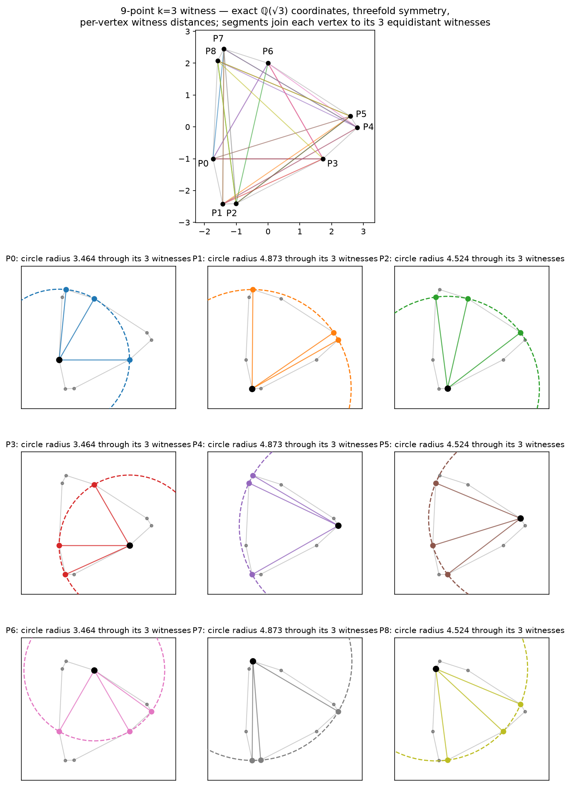
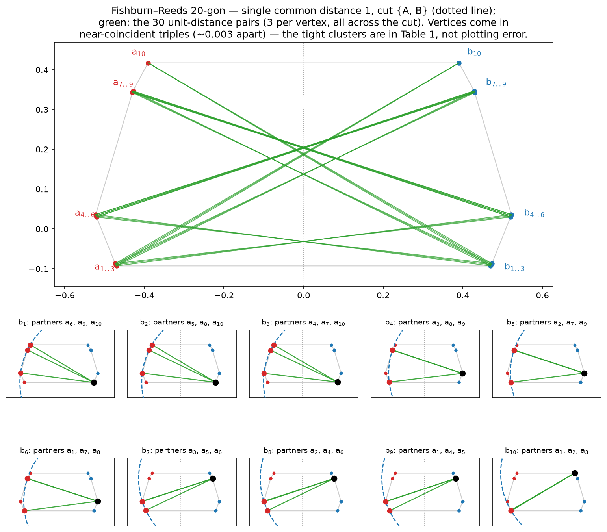

# Erdős Problems 97 & 96 - Lean 4 formalization

A Lean 4 formalization of the resolutions of two Erdős problems on convex
point sets in the plane, checked against the canonical problem statements
in [`formal-conjectures`](https://github.com/google-deepmind/formal-conjectures).

The remaining direct production proof surface is **21 `sorry`-carrying leaf
theorems**, all in the A-tail frontier below the route-B tail of the
removable-vertex core (`P97/ATail/FrontierLiveClosure.lean`, four of them in
its nested `TwoSourceExactCollisionRowsTerminal` namespace). The frontier's
former two parent obligations are source-clean checked coordinators that now
fan out, through several further case splits, into nine named computational
case packages tracked in `census/frontier-packages/` (B1, B2, B3, A, C, D-R,
D-E, E, F-Γ) plus the still-open collision/blocker terminal branches. Each
package has a finite named-local incidence abstraction that is SAT-audited
(satisfiable, with DRAT-checked negative probes) but this is explicitly **not**
a closure of the corresponding Lean leaf — see **Proof status** below and
`census/frontier-packages/SESSION3-TRIAGE-2026-07-28.md` for the leaf-by-leaf
computational status and what each still needs. The endpoint, pinned-surplus,
and erased-pin
Front-B branches are closed; the ERASE card-{10,11} classifier closure is
committed at `652fdfcb`. **This is the main repo where the proof is being
closed.** The former companion repo
`p97-rvol` is historical as of 2026-07-06: its U-lane route-B tail was
imported here on 2026-07-05, and its status docs are superseded by this
repo. See **Proof status** below for the kernel-reported state.

Current Rigid221 checkpoint: exact cardinalities 12 through 16 are closed for
the source-heavy BlockerV residual.  At exact 17, the second-cap-10 and
second-cap-11 profiles reduce respectively to the checked exact-16 and
exact-15 banks; only the exact-17/second-cap-9 profile remains, alongside the
unbounded `|A| ≥ 18` continuation.  This is branch-local narrowing, not an
exclusion of all 17-point P97 counterexamples.

## What is formalized

Two upstream-vocabulary theorems are exported. Each is *definitionally* the
right-hand side of the corresponding `formal-conjectures` statement, so
building this repository checks the proofs against the upstream definitions
(`Erdos97.*` / `Erdos96.*`), not a private restatement.

### Problem 97 - [`Problem97.erdos97_rhs`](lean/Erdos9796Proof/P97/UpstreamBridge.lean#L30)

> A convex-independent set of points in the plane cannot have the property
> that every point has 4 others equidistant from it.

```lean
theorem erdos97_rhs :
    ∀ A : Finset ℝ², A.Nonempty → EuclideanGeometry.ConvexIndep (A : Set ℝ²) →
      ¬ Erdos97.HasNEquidistantProperty 4 A
```

This is the RHS of upstream
[`Erdos97.erdos_97`](https://github.com/google-deepmind/formal-conjectures/blob/89a67be506fbae633d02941ccbd9f3737bbd5457/FormalConjectures/ErdosProblems/97.lean#L76)
(materialized under `lean/.lake/` from the rev pinned in `lake-manifest.json`).
The bridge [`Problem97.upstream_iff`](lean/Erdos9796Proof/P97/UpstreamBridge.lean#L22)
is `Iff.rfl`.

### Problem 96 - [`Problem96.erdos96_rhs`](lean/Erdos9796Proof/P96/UpstreamBridge.lean#L96)

> The maximum number of unit distances determined by `n` points in convex
> position is `O(n)` - here with explicit constant `3`.

```lean
theorem erdos96_rhs :
    (fun n => (Erdos96.maxConvexUnitDistances n : ℝ)) =O[atTop]
      fun n => (n : ℝ)
```

This is the RHS of upstream
[`Erdos96.erdos_96`](https://github.com/google-deepmind/formal-conjectures/blob/89a67be506fbae633d02941ccbd9f3737bbd5457/FormalConjectures/ErdosProblems/96.lean#L69),
obtained from the per-set bound `unitDistancePairsCount A ≤ 3 * A.card` for
convex `A` ([`unit_distance_pairs_bound`](lean/Erdos9796Proof/P96/EuclideanPeeling.lean#L289)).

## Proof status

**Both published claims still reach `sorryAx` through twenty-one direct A-tail
leaf theorems** (`proof-blueprint spine`, current as of this checkout). The
hard core of the descent step —
[`RemovableVertexOfLarge`](lean/Erdos9796Proof/P97/RemovableVertexAxiom/Continuation.lean#L811)
(*every nonempty convex `HasNEquidistantProperty 4` set with `9 < |A|` that is
minimal under the strong-induction hypothesis contains a removable vertex*) —
is assembled from a three-way split (surplus-cap packet extraction, the
`IsM44` pinned-surplus branch, the non-`IsM44` descent branch). The
current direct source obligations are all in
`P97/ATail/FrontierLiveClosure.lean` (four of them in its nested
`TwoSourceExactCollisionRowsTerminal` namespace), grouped below by the named
computational case package each belongs to
(`census/frontier-packages/SESSION3-TRIAGE-2026-07-28.md` has the full
leaf-by-leaf computational status and first-missing-bridge description):

| Package | Leaves open | What each package's SAT audit has (and has not) established |
|---|---:|---|
| B1 | 1 | Direct-shadow SAT only; not yet an official package verdict (prerequisite ingress missing) |
| B2, B3 | 2 | Named-local canonical-row / mutual-omission projection SAT; needs a global/metric consequence beyond it |
| A | 6 | All eight v1.3 runs SAT, all negative probes DRAT-verified; needs exact metric/global geometry beyond the current clause set |
| C | 2 | Base/C1/C2 SAT, all probe UNSATs DRAT-verified; needs a metric/global realization obstruction beyond the placement projection |
| D-R | 2 | SAT with 25/25 negative probes DRAT-verified; needs a finite consequence of universal no-five/no-M44 or exact real-radius content |
| D-E | 2 | Open-carrier named-witness projection SAT; needs a proved finite cutoff or cardinality-free symbolic certificate |
| E | 1 | Counting/incidence abstraction SAT; needs the unencoded all-low-hit family plus remaining survival/minimality geometry |
| F-Γ | 4 | No finite completeness reduction; v17 local metric search leaves an 18-class survivor, while the exact full probe and 205 six-class cases remain fail-closed `UNKNOWN` |
| **Total** | **20** | |

Every SAT verdict above is a finite named-local incidence abstraction, not a
Euclidean realization, and does **not** refute or close the corresponding
Lean leaf; every DRAT-checked UNSAT is a smoke/probe result, not a verdict for
a live leaf. The census/SAT lane's own accounting (SESSION3-TRIAGE, dated
2026-07-28) states this explicitly: "the Session-3 result is therefore zero
computational closures." The checked parent coordinators
`false_of_originalFrontierUniqueRadiusArm` and
`false_of_twoLargeCaps_commonCriticalMap` (among others in the chain) are
source-clean and dispatch exhaustively down to these leaves, with the
exact-four card-11 branch closed by the promoted certificate ingress.
Refreshing `proof-blueprint` after the production build confirms publish-spine
reachability. The former shared-radius and LIVE-Q/C declarations were bypassed
and retired when the caller moved to `CriticalPairFrontier`; they were not
individually proved.
The former Front-B obligations `isM44EndpointResidualsExcluded`,
`isM44PinnedSurplusResidualsExcluded`, and
`isM44NonSurplusContainmentErasedPinTripleResidualsExcluded` are source-clean
and kernel-connected. The downstream exact-pin ERASE target is 0/1376 open
and passes target-specific `proof-blueprint verify-publish` under the approved
axiom set.

The Lean kernel reports the axiom closure of both published claims as the
Lean core axioms plus:

- `sorryAx` — traces exactly to the twenty A-tail leaves above;
- `Lean.ofReduceBool` and `Lean.trustCompiler` — from `native_decide` in the
  generated finite-bank certificate shards (`SurplusCOMPGBank*`,
  `EndpointCertificate/*`), allowed under the project's `native_decide`
  policy (kernel-checked closure + the evaluated checkers are plain verified
  Lean with no `unsafe` / `@[implemented_by]` / `@[extern]`).

Once those twenty leaves are proven, `sorryAx` drops out and both closures
become the core axioms plus the two compiler axioms — the declared trust
boundary of the certificate infrastructure.

You can reproduce this check after building (see below):

```bash
mkdir -p scratch/checks
printf '%s\n' 'import Erdos9796Proof.P97.UpstreamBridge
import Erdos9796Proof.P96.UpstreamBridge
#print axioms Problem97.erdos97_rhs
#print axioms Problem96.erdos96_rhs' > scratch/checks/ax_check.lean
cd lean
lake env lean ../scratch/checks/ax_check.lean
```

## Headline theorems

Both publish targets are open, but a substantial body of results below them is
not. Everything in this section is **unconditionally proved** — axiom closure
exactly `{propext, Classical.choice, Quot.sound}`, no `sorryAx`, no custom
axioms, and no `native_decide` — except the two rows in *Erdős 97 ⟹ Erdős 96*,
which are conditional on a hypothesis that appears explicitly in their
statements.

Every theorem listed here is independently gated in [`comparator/`](comparator/),
which restates it using **mathlib vocabulary alone** — no definition from this
repository — and checks that the project's proof discharges that restatement.
A reviewer can read [`comparator/Challenge.lean`](comparator/Challenge.lean),
which imports only `Mathlib`, and see exactly what is being claimed without
trusting anything here.

The real [leanprover/comparator](https://github.com/leanprover/comparator) run
**passes** (verified 2026-07-26): all 24 statements compared identical at the
export level, axioms confined to the three core axioms, and the export replayed
through **both** the `nanoda` kernel and the Lean default kernel — 41239
declarations, no errors, `Your solution is okay!`.
[`comparator/README.md`](comparator/README.md) documents the exact invocation,
including a non-obvious `lean4export` version pin needed at Lean v4.27.0.
`./comparator/check-conformance.sh` is the cheap offline pre-flight (build +
axiom audit, no external toolchain).

A **second, compiler-trusted tier** (`comparator/config-native.json`, added
2026-07-30) gates 6 further results whose proofs run the finite certificate
banks through `native_decide`. These are sorry-free but additionally depend on
`Lean.ofReduceBool` and `Lean.trustCompiler`, so they are held in a separate
manifest rather than diluting the three-axiom set above — the project's
`native_decide` policy requires compiler trust to be explicit and reported.

### Erdős 97 — compiler-trusted finite endpoints

| Theorem | Statement |
|---|---|
| [`Problem97.FiniteN10Closure`](lean/Erdos9796Proof/P97/FiniteN10.lean#L182) | there is no 10-point counterexample |
| `Headline.counterexample_card_ge_eleven` | every counterexample has at least 11 points |
| `Headline.erdos97_of_card_le_ten` | Erdős 97 holds for every point set of at most 10 points |
| [`Problem97.FiniteN11Closure`](lean/Erdos9796Proof/P97/FiniteN11.lean#L44) | **there is no 11-point counterexample** |
| `Headline.counterexample_card_ge_twelve` | **every counterexample has at least 12 points** |
| `Headline.erdos97_of_card_le_eleven` | **Erdős 97 holds for every point set of at most 11 points** |

The three `Headline.` rows are composed in
[`comparator/Solution.lean`](comparator/Solution.lean) from the endpoint below
them and the bound above them; they have no single project namesake. The
exact-eleven endpoint closed on 2026-08-01: its card-eleven exact-five
common-obstruction-center leaf is discharged by the authenticated G3 and
retained-`s2_o0` certificate banks, and `#print axioms
Problem97.FiniteN11Closure` measures exactly `{propext, Classical.choice,
Lean.ofReduceBool, Lean.trustCompiler, Quot.sound}` with no `sorryAx`.

Each of the six has been measured directly at `{propext, Classical.choice,
Lean.ofReduceBool, Lean.trustCompiler, Quot.sound}` with no `sorryAx`. The
offline pre-flight (`comparator/check-conformance.sh`) and the `pp.explicit`
statement-identity diff have been run in full for the three exact-ten results.
For the three exact-eleven results the `pp.explicit` diff now also passes with 0
differences, as do the pre-flight's manifest cross-check and tier-disjointness
steps; `Challenge.lean` elaborates against mathlib alone with all 30 stubs, and
all 30 source signatures match between `Challenge.lean` and `Solution.lean`.
Outstanding: the pre-flight's build and axiom-audit steps, and a real comparator
run. The import cycle that blocked the former was fixed in `b075da44`. See
`comparator/README.md`, "Native-tier status", for the exact split.

### Erdős 97 — unconditional partial results

| Theorem | Statement |
|---|---|
| [`Problem97.counterexample_card_ge_nine`](lean/Erdos9796Proof/P97/Counting.lean#L95) | every counterexample has at least 9 points |
| [`Problem97.FiniteN9Closure`](lean/Erdos9796Proof/P97/N9Endpoint/Closure.lean#L56) | there is no 9-point counterexample |
| [`Problem97.counterexample_card_ge_ten`](lean/Erdos9796Proof/P97/SmallCardinality.lean#L31) | **every counterexample has at least 10 points** |
| [`Problem97.not_hasNEquidistantProperty_four_of_card_le_nine`](lean/Erdos9796Proof/P97/SmallCardinality.lean#L43) | **Erdős 97 holds for every point set of at most 9 points** |
| [`Problem97.UniversalProblem97_of_reduction`](lean/Erdos9796Proof/P97/UniversalProblem97.lean#L60) | a counting obstruction plus a descent step above 9 yield Erdős 97 in full |

The three-core-axiom result in this table gives `n ≥ 10`; the compiler-trusted
finite endpoints in the table above strengthen the project bound to `n ≥ 12`.
As far as we are aware, even the former is the best published
bound on the size of a hypothetical counterexample. {{UNVALIDATED}} — the
literature check found only an unrefereed argument for `n ≥ 7` on the
erdosproblems.com discussion page; treat the record claim as unconfirmed, not
the machine-checked bounds.

### The pinned-multiplicity reformulation

For `p ∈ A` write μ(p, A) for the largest number of points of `A` on a single
circle of positive radius centred at `p`. Then

> Erdős 97 ⟺ every finite `A ⊆ ℝ²` in strictly convex position has a point `p`
> with μ(p, A) ≤ 3.

| Theorem | Statement |
|---|---|
| [`Problem97.universalProblem97Statement_iff_pinnedMultiplicity`](lean/Erdos9796Proof/P97/PinnedMultiplicity.lean#L233) | the equivalence above |
| [`Problem97.exists_pinnedMultiplicity_le_three_of_card_le_nine`](lean/Erdos9796Proof/P97/UniversalLocal.lean#L93) | its unconditional `\|A\| ≤ 9` instance |

This is a **reformulation, not a proof**: the equivalence is kernel-clean, both
sides remain open.

The framing is Erdős's own, not a modern restatement. *On sets of distances of n
points*, Amer. Math. Monthly 53 (1946), 248–250, §2, p. 248 states the `k = 3`
version — "In every convex polygon there is at least one vertex with the
property that no three vertices of the polygon are equally distant from it" —
and then immediately the multiplicity form itself: "A still stronger conjecture
is that on every convex curve there exists a point `P` such that every circle
with center `P` intersects the curve in at most 2 points." The `k = 4` version
targeted here is Erdős, *Some combinatorial and metric problems in geometry*,
Colloq. Math. Soc. J. Bolyai 48 (1987), **p. 176**, alongside Danzer's nonagon.

Three neighbouring conjectures are easily conflated, and only the third is this
target: **#93**, a convex `n`-gon determines ≥ `⌊n/2⌋` distinct distances
globally — *proved* by Altman (Amer. Math. Monthly 70 (1963), 148–157); **#982**,
some vertex has ≥ `⌊n/2⌋` distinct distances (pinned count) — open; **#97**, some
vertex has no four others equidistant from it (pinned multiplicity) — open.

Brass–Moser–Pach, *Research Problems in Discrete Geometry* (2005), §5.6, p. 218
is the standard reference. It poses the problem in the pinned form ("*any circle
around it passes through at most k other points*") and states the target as
Conjecture 3 ("*no four other vertices at the same distance*") in the same
paragraph, with no remark on the equivalence — which is the best evidence that
it is treated as immediate rather than as a step worth recording. **Note their
indexing:** BMP's `k` counts *other* points, so BMP's "`k = 2` refuted by Danzer,
open at `k = 3`" is this repository's "`k = 3` refuted, `k = 4` open".

The module docstring in
[`PinnedMultiplicity.lean`](lean/Erdos9796Proof/P97/PinnedMultiplicity.lean)
records why distinct-distance results do not transfer: they constrain the
*average* multiplicity at `p`, whereas Erdős 97 bounds the *maximum*. In
particular Altman's `⌊n/2⌋` does **not** apply — it is a global count over all
pairs, not a bound at any vertex, so it yields no pinned lower bound at all.

### Erdős 97 ⟹ Erdős 96, with explicit constant 3

| Theorem | Statement |
|---|---|
| [`Problem96.unit_distance_pairs_bound_of_erdos97`](lean/Erdos9796Proof/P96/EuclideanPeeling.lean#L273) | Erdős 97 ⟹ at most `3n` unit-distance pairs in convex position |
| [`Problem96.erdos96_rhs_of_erdos97`](lean/Erdos9796Proof/P96/UpstreamBridge.lean#L82) | Erdős 97 ⟹ Erdős 96 |

Both take `Problem97.UniversalProblem97Statement` as an explicit hypothesis, so
the dependence is visible in the statement rather than hidden in the proof. The
implication is **not new** — Pach and Agarwal state it with the constant in
*Combinatorial Geometry* (1995), p. 206, without proof, and Erdős asserts it
himself in *Eureka* 51 (1992), 44–48, p. 45: "I conjectured that in every convex
n-gon there is a vertex which does not have four vertices equidistant from it.
If true this is very much stronger than (4)", where (4) is `max sᵢ < cn`, the
Erdős 96 bound. (He offers £100 there — the first prize attached to this
conjecture.) What is complete here is the formal proof, and it is what makes the
whole P96 branch's openness enter through exactly one gateway.

### The counting engine

| Theorem | Statement |
|---|---|
| [`Problem97.CGN8_circumscribed_iCount_upper_bound`](lean/Erdos9796Proof/P97/CGN/CGN8.lean#L31) | isosceles count `iCount A ≤ (11n² − 18n)/12` for circumscribed convex-independent `A` |
| [`Problem97.six_mul_card_le_iCount_of_K4`](lean/Erdos9796Proof/P97/IsoscelesCount.lean#L153) | the 4-equidistant property forces `6n ≤ iCount A` |
| [`Problem97.MEC.exists_unique_minimum_enclosing_circle`](lean/Erdos9796Proof/P97/MEC/Basic.lean#L255) | existence and uniqueness of the minimum enclosing circle |
| [`Problem97.MEC.sylvester_dichotomy`](lean/Erdos9796Proof/P97/MEC/Boundary.lean#L557) | Sylvester (1857): the MEC is a diameter, or at least 3 points lie on it |

mathlib has no minimum enclosing circle; this development builds one. See
[`comparator/README.md`](comparator/README.md) for the full gated list (24
core-tier theorems, including the Welzl invariant, the Moser non-obtuse triple,
the Dumitrescu/Fox–Pach double count, and the planar metric kernels, plus 3 in
the compiler-trusted tier), for how each project definition is inlined into
mathlib terms, and for the audit boundary — what is deliberately *not* gated,
and why.

## Building from a clean checkout

Requires [`elan`](https://leanprover-community.github.io/install/) (the Lean
toolchain manager) and `uv`; the pinned toolchain is
`leanprover/lean4:v4.27.0` and is fetched automatically.

```bash
git clone <this-repo>
cd <this-repo>

cd lean

# Fetch the prebuilt mathlib cache (also materializes the pinned dependencies
# from lake-manifest.json: mathlib v4.27.0 and formal-conjectures).
lake exe cache get

# Return to the repository root and use the serialized build wrapper.
cd ..
./scripts/lake-build.sh
```

Or use the convenience wrapper from the repository root, which holds a build
lock so concurrent invocations serialize:

```bash
./scripts/lake-build.sh
```

A successful build prints `declaration uses 'sorry'` warnings for the twenty
leaf theorems in `P97/ATail/FrontierLiveClosure.lean` and nothing else of
substance.
(Lean's mathlib-style linters emit a handful of cosmetic
style/`simp` hints; these are not errors.)

**Note on dependencies.** `lake-manifest.json` is committed and pins exact
dependency revisions, so the build is reproducible. Do **not** run
`lake update` - it would re-resolve `formal-conjectures` to the latest `main`
and break the pin.

The promoted card-eleven certificate source graph is on the published import
spine and closes the card-11 exact-four branch. Its 922 compact and 742
windowed replay modules, together with their 1,656 directly referenced source
assets, are committed under the main `Erdos9796Proof` library, so a clean
checkout needs no historical-tree path, vendor package, or separately
distributed replay bundle. The promotion manifest supports a self-contained
`--check`; scratch provenance is consulted only by the explicit
`--check-source` regeneration audit. The promoted graph has no `sorryAx`;
generated `native_decide` proofs contribute
`Lean.ofReduceBool` and `Lean.trustCompiler`, both included in the project's
approved trust boundary.

## Repository layout

```
lean-toolchain                -- root commands use leanprover/lean4:v4.27.0
lean/
  Erdos9796.lean              -- root: re-exports upstream statements + the proofs
  Erdos9796Proof.lean         -- root: the two upstream-vocabulary bridge theorems
  Erdos9796Proof/
    P97/                      -- Problem 97 proof library
      UpstreamBridge.lean       -- erdos97_rhs (the published theorem)
      UniversalProblem97.lean   -- the strong-induction wrapper
      UniversalLocal.lean       -- instantiated statement + the |A| ≤ 9 closure
      PinnedMultiplicity.lean   -- the μ(p,A) ≤ 3 reformulation
      Counting.lean             -- counting engine (forces |A| ≥ 9)
      Descent.lean              -- descent engine (kills |A| > 9)
      RemovableVertexAxiom.lean -- removable-vertex assembly; A-tail leaves downstream
      U1LargeCapRouteBTail.lean -- imported U-lane route-B tail; source-clean coordinator
      ATail/
        FrontierLiveClosure.lean -- twenty load-bearing production leaf obligations
        CardElevenUniqueFourCertificateIngress.lean -- closed card-11 exact-four branch
      Foundation.lean           -- shared vocabulary + signed-area primitives
      Dumitrescu/               -- isosceles-counting lemma chain (L1 … Lc3)
      CGN/                      -- cap-witness counting bridge (CGN … CGN8)
      N4d/                      -- n=9 form-exclusion case analysis (20 files)
      N9Endpoint/  N8/          -- n=9 base-case assembly
      Cap/  MEC/  Moser/        -- cap structures, min-enclosing circle, Moser triangle
      U2/                       -- similarity-normalization lane
      SurplusM44Packet.lean     -- (m,4,4) surplus-cap packet vocabulary
      SurplusCOMPGBank*.lean    -- generated finite COMP-G bank + DFS bridge
      EndpointCertificate/      -- generated polynomial-certificate corpus
                                --   (Checker.lean + Patterns/*, native_decide)
      U1*/U3*/U5*.lean          -- imported U-lane modules (2026-07-05)
      ConvexCyclicOrder/        -- convex cyclic-order construction
      ...                       -- other shared geometry kernels in the root
    P96/                      -- Problem 96 proof library (2 files)
      UpstreamBridge.lean     -- erdos96_rhs
      EuclideanPeeling.lean   -- the ≤ 3·n unit-distance bound
  lakefile.toml               -- build config + dependency requires
                              --   (also wires the comparator/ libs below)
  lake-manifest.json          -- pinned dependency revisions
  lean-toolchain              -- same Lean v4.27.0 pin for commands under lean/
comparator/                   -- mathlib-only auditability gate (see its README)
  Challenge.lean              -- headline claims as sorry stubs, `import Mathlib`
  Solution.lean               -- same statements, discharged from the project
  config.json                 -- core tier: 3 core axioms only (24 theorems)
  axiom-audit.lean            -- #print axioms for every core-tier theorem
  config-native.json          -- native tier: + ofReduceBool/trustCompiler (6)
  axiom-audit-native.lean     -- #print axioms for every native-tier theorem
  check-conformance.sh        -- offline pre-flight, both tiers
certificates/                 -- JSON certificate banks (endpoint/, surplus/)
scripts/
  lake-build.sh               -- locked build wrapper
  endpoint-certificate.py     -- polynomial-certificate generator/emitter
  escape-census.py            -- escape-census enumeration
  surplus-compg-shadow.py     -- COMP-G shadow/bank generator
docs/                         -- working plans, dead-ends log, audits
```

The default `lake build` compiles the full import closure of the two published
theorems. That closure now includes the 2,061-module promoted card-eleven
certificate graph described above. The generated corpus under
`EndpointCertificate/Patterns/` is also transitively imported on the published
spine and supports the already-closed endpoint branch; it is no longer
explicit-target-only input for a pending endpoint residual.

## Proof architecture - where to look

This section is a map for someone who has never seen the proof. Every name
below links to the exact declaration. (Links resolve on GitHub against the
current `main`; line numbers track this commit.)

The Problem 97 proof is a single **strong induction on the cardinality `|A|`**
of a hypothetical convex-independent counterexample, driven by two engines and
bottoming out in a finite base case:

- a **counting engine** that forces any counterexample to have `|A| ≥ 9`;
- a **descent engine** that, for `|A| > 9`, produces a strictly smaller
  counterexample - contradicting minimality;
- a **base case** that rules out `|A| = 9` directly by a large geometric
  case analysis.

So `|A| < 9` is impossible (counting), `|A| > 9` is impossible (descent), and
`|A| = 9` is impossible (base case) - no counterexample exists.

### Start here: the spine

Read these in order; each line is the load-bearing declaration of its step.

1. [`erdos97_rhs`](lean/Erdos9796Proof/P97/UpstreamBridge.lean#L30) - the
   published theorem, definitionally the upstream RHS (the rest of the file is
   the `Iff.rfl` bridge).
2. [`UniversalProblem97`](lean/Erdos9796Proof/P97/UniversalLocal.lean#L44) -
   instantiates the induction wrapper with the two engines (below) discharged.
3. [`UniversalProblem97_of_reduction`](lean/Erdos9796Proof/P97/UniversalProblem97.lean#L60)
   - the strong-induction wrapper itself. It takes the two engines bundled in
   [`UniversalReductionHypotheses`](lean/Erdos9796Proof/P97/UniversalProblem97.lean#L37)
   (the `counting` bound and the `descent` step) and calls the base case
   directly for `|A| = 9`.
4. **Base case** `|A| = 9`:
   [`FiniteN9Closure`](lean/Erdos9796Proof/P97/N9Endpoint/Closure.lean#L71).
5. **Counting engine** (`|A| ≥ 9`):
   [`counterexample_card_ge_nine`](lean/Erdos9796Proof/P97/Counting.lean#L95).
6. **Descent engine** (`|A| > 9`):
   [`descent_contradicts_minimality`](lean/Erdos9796Proof/P97/Descent.lean#L27),
   which consumes
   [`RemovableVertexOfLarge`](lean/Erdos9796Proof/P97/RemovableVertexAxiom/Continuation.lean#L811)
   (assembled; carries the five residual obligations) plus the glue
   [`smaller_counterexample_of_removable`](lean/Erdos9796Proof/P97/SmallerCounterexample.lean#L30).

### Shared foundations

The vocabulary and core geometric objects every cluster builds on:

- [`Foundation.lean`](lean/Erdos9796Proof/P97/Foundation.lean) - re-exports the
  upstream predicates and defines the signed-area primitives:
  [`ConvexIndep`](lean/Erdos9796Proof/P97/Foundation.lean#L28),
  [`signedArea2`](lean/Erdos9796Proof/P97/Foundation.lean#L49),
  [`OnArcOpposite`](lean/Erdos9796Proof/P97/Foundation.lean#L57).
- [`MinEnclosingCircle`](lean/Erdos9796Proof/P97/MEC/Basic.lean#L66) (existence +
  uniqueness) and the [`MoserTriangle`](lean/Erdos9796Proof/P97/Moser/Triangle.lean#L59)
  it determines - the three boundary vertices the whole analysis is framed
  around.
- [`CapTriple`](lean/Erdos9796Proof/P97/Cap/Structure.lean#L161) - the
  decomposition of the point set into the three circular "caps" cut off by the
  Moser triangle.
- [`IsRemovableVertex`](lean/Erdos9796Proof/P97/SmallerCounterexample.lean#L25)
  - the predicate the descent step is built to produce.

### The counting engine (forces `|A| ≥ 9`)

A Dumitrescu-style double count of isosceles configurations: a lower bound
`6·|A| ≤ iCount(A)` against a cap-local upper bound forces `|A| ≥ 9`.

- [`iCount`](lean/Erdos9796Proof/P97/IsoscelesCount.lean#L39) - the isosceles
  count, defined in `IsoscelesCount.lean`.
- the [`Dumitrescu/`](lean/Erdos9796Proof/P97/Dumitrescu) dir (`L1.lean …
  Lc3.lean`) - the lemma chain establishing the lower bound
  (perpendicular-bisector, double-count, three-cap, Cauchy–Schwarz,
  Thales-angle, …).
- [`CGN8_circumscribed_iCount_upper_bound`](lean/Erdos9796Proof/P97/CGN/CGN8.lean#L31)
  - the matching cap-local upper bound (top of the
  [`CGN/`](lean/Erdos9796Proof/P97/CGN) counting-bridge stack).
- [`Counting.lean`](lean/Erdos9796Proof/P97/Counting.lean) combines the two with
  the arithmetic in `CountingArithmetic.lean`.

### The `n = 9` base case (the bulk of the files)

Most of the hand-written P97 files implement the finite case analysis behind
`FiniteN9Closure`. It threads a fixed 9-point shell through form exclusions and
a final single-apex exhaustion:

- [`FiniteEndpointShell`](lean/Erdos9796Proof/P97/N9Endpoint/Shell.lean#L39) - the
  structure packaging the fixed 9-point setup (`N9Endpoint/Shell.lean`); the
  closure is assembled in `N9Endpoint/Closure.lean`, with `N9Endpoint/N4e.lean`
  (cap containment) and `N9Endpoint/N67.lean` (rigid common-radius packet).
- **`N4d/` form exclusions** - three geometric "forms" excluded at each of three
  apex relabellings:
  [`N4dExcludesFormA_v1_proof`](lean/Erdos9796Proof/P97/N4d/ExcludesFormAv1.lean#L645),
  [`…FormB…`](lean/Erdos9796Proof/P97/N4d/ExcludesFormBv1.lean#L742),
  [`…FormC…`](lean/Erdos9796Proof/P97/N4d/ExcludesFormCv1.lean#L766), with the
  `v₂`/`v₃` variants produced by `N4d/CyclicTransport.lean` and the many other
  [`N4d/`](lean/Erdos9796Proof/P97/N4d) files supplying form-specific geometry.
- **`N8` single-apex exhaustion** - the final contradiction, routed by
  [`N8k_single_apex_false`](lean/Erdos9796Proof/P97/N8/N8kDistribution.lean#L1110)
  through the two-circle / endpoint-pair / reflection primitives in the
  [`N8/`](lean/Erdos9796Proof/P97/N8) subdirectory.

### The descent step and the removable-vertex lemma

- [`RemovableVertexAxiom.lean`](lean/Erdos9796Proof/P97/RemovableVertexAxiom.lean)
  - assembles `RemovableVertexOfLarge` (every minimal counterexample with
  `|A| > 9` has a removable vertex) from the three-way split. Its three former
  slot-2 residual branches are now closed.
- [`SmallerCounterexample.lean`](lean/Erdos9796Proof/P97/SmallerCounterexample.lean)
  - turns a removable vertex into a strictly smaller counterexample.
- [`Descent.lean`](lean/Erdos9796Proof/P97/Descent.lean) - packages the two into
  the contradiction-with-minimality shape the induction wrapper consumes.

### Status of the removable-vertex lemma: current residuals

The twenty A-tail leaves in the **Proof status** table are the open frontier;
everything else on the descent path is closed and kernel-audited: the base
case `FiniteN9Closure` (axiom closure: `propext, Classical.choice,
Quot.sound`), the cap-sum bridge (`|A| > 9 ⇒ some opposite cap is surplus`),
the counting bound `counterexample_card_ge_nine` (`|A| ≥ 9`), the surplus-cap
packet extraction (`largeK4SurplusCapPacket`), the pinned-surplus finite-bank
handoff (`pinnedSurplusCOMPGBankBridge`), and the non-`IsM44` descent adapter
(`removableVertexOfLarge_of_nonIsM44`).

**Active work happens in this repo.**
[`docs/closure-plan-full-spec-2026-07-09.md`](docs/closure-plan-full-spec-2026-07-09.md)
is the single current closure plan (cross-cutting strategy, gates, dispatch
specs, uncertainty register), and
[`docs/closure-matrix-2026-07-09.md`](docs/closure-matrix-2026-07-09.md) is its
executable task register.
[`docs/97-rvol-full-prose-proof-2026-07-13.md`](docs/97-rvol-full-prose-proof-2026-07-13.md)
is the dated full prose proof of the Problem 97 target — the self-contained
end-to-end mathematical narrative with per-component proved/open status,
kernel axiom closures, and a completion matrix stating each obligation.
[`docs/notes/sms-ccl-application-recommendation-2026-07-13.md`](docs/notes/sms-ccl-application-recommendation-2026-07-13.md)
is a research recommendation mapping SAT-modulo-symmetries and co-certificate
learning onto the census/mining lanes (papers mirrored in `docs/references/`).
The former July 6 master plan, the dated sorry-level ledger, and the two
slot-3/slot-2 U-lane execution logs (both now-closed lanes) are historical
records under
[`docs/archive/2026-07-10-closure-plan-consolidation/`](docs/archive/2026-07-10-closure-plan-consolidation/)
and
[`docs/archive/2026-07-16-doc-sweep/`](docs/archive/2026-07-16-doc-sweep/).
Analysis snapshots live under [`docs/audits/`](docs/audits).
[`docs/dead-ends.md`](docs/dead-ends.md) is the don't-repeat log for closed
proof routes.

**Historical note.** The U-lane route-B tail was developed in the companion
repo `p97-rvol` and imported here on 2026-07-05 (58 modules,
`RVOL.P97.*` → `Erdos9796Proof.P97.*`). As of 2026-07-06, `p97-rvol` and the
other companion repos are historical — frozen references, not live work
targets; their status docs are superseded by this repo.

The former off-spine `U2OppCap2Escape.lean` work is archived under `attic/`.
All current production proof `sorry`s are in
`P97/ATail/FrontierLiveClosure.lean`.

### Problem 96

Self-contained in the [`P96/`](lean/Erdos9796Proof/P96) directory and much
smaller: a vertex-peeling argument gives the per-set bound
[`unit_distance_pairs_bound`](lean/Erdos9796Proof/P96/EuclideanPeeling.lean#L289)
(`≤ 3·|A|`), which [`UpstreamBridge.lean`](lean/Erdos9796Proof/P96/UpstreamBridge.lean#L69)
lifts to the asymptotic `O(n)` statement. Each of those steps also has an
explicitly conditional variant taking `Problem97.UniversalProblem97Statement` as
a hypothesis
([`unit_distance_pairs_bound_of_erdos97`](lean/Erdos9796Proof/P96/EuclideanPeeling.lean#L273),
[`erdos96_rhs_of_erdos97`](lean/Erdos9796Proof/P96/UpstreamBridge.lean#L82));
those are unconditionally proved and are what isolate the P96 branch's openness
to a single gateway.

### Supporting clusters

These provide reusable geometric machinery imported throughout the above:

- **[`Cap/`](lean/Erdos9796Proof/P97/Cap)** - cap partition, structure, and
  cone/arc containment (plus `ArcPartitionCount.lean` in the root).
- **[`ConvexCyclicOrder/`](lean/Erdos9796Proof/P97/ConvexCyclicOrder) /
  `SignedAreaOangle.lean` / `OangleBridge.lean`** - cyclic-order construction and
  the bridge between the algebraic `signedArea2` and Mathlib's oriented angle
  `oangle`.
- **[`U2/`](lean/Erdos9796Proof/P97/U2)** - similarity normalization and one-hit
  witness bounds.
- **`A1*`** (incl. [`Bridge/A1SpineWiring.lean`](lean/Erdos9796Proof/P97/Bridge/A1SpineWiring.lean))
  - the row-layer context producers wiring shell facts into the endpoint forms.
- **Geometry kernels** - `TwoCircleCrossing.lean`, `NoDiameterUnderK4.lean`,
  `CircumcenterSide.lean`, `MidpointInequality.lean`,
  `CircumscribedMECPacket.lean`.

## Known k = 3 witnesses (counterexample-search lane)

Problem 97 is the k = 4 instance of "every point has k others equidistant
from it, in convex position." For k = 3 the property **is** realizable; the
search lane (`docs/p97-counterexample-search-design-2026-07-28.md`) carries
the two known witnesses as positive controls. In both figures, each dashed
circle is centered at a vertex and passes through that vertex's 3
equidistant witnesses.



Nine points with exact ℚ(√3) coordinates, threefold symmetry, and a witness
distance that **varies per vertex** (Danzer-style). Coordinates verified
twice by independent exact arithmetic
(`scratch/p97-search-lane/verify_k3_control.py`); note n = 9 is exactly the
unconditional floor for a k = 4 counterexample.



The Fishburn–Reeds 1992 20-gon: a **single common distance** 1, every
vertex's 3 witnesses lying across a convex cut {A, B}, and n = 20 proven
minimal for the cut-restricted version. Table-1 coordinates transcribed and
numerically verified in `scratch/p97-search-lane/fishburn-reeds-notes.md`;
exact certification of the configuration is the realization arm's
validation target (`scratch/p97-search-lane/fr-certify/`). Plots:
`scratch/p97-search-lane/plot_k3_witnesses.py`.
