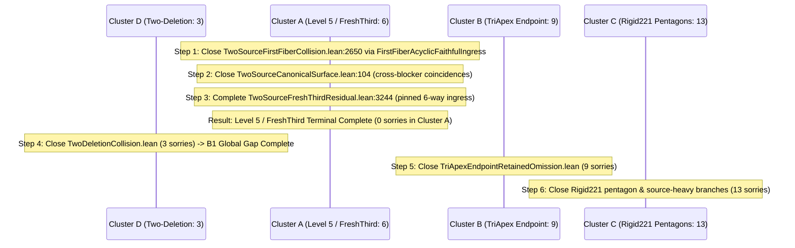

# Problem 97 ATail: Spine Leverage Analysis & Closure Roadmap

**Date**: 2026-08-17  
**Build Status**: `lake-build` verified clean (10,865 jobs, exit code 0)  
**Spine Target**: `Problem97.ATailFrontierLiveClosure.TwoSourceExactCollisionRowsTerminal`  
**Active On-Spine Sorries**: 34 effective  

---

## 1. Executive Summary

This document presents a topological analysis of the 34 remaining effective `sorry` declarations on the live Problem 97 ATail kernel spine. The spine sorries partition cleanly into **4 structural clusters**. 

The **highest-leverage immediate target** is **Cluster A (`TwoSourceExactCollisionRowsTerminal` / Level 5)**, which contains 5 sorries. Because `TwoSourceFreshCanonicalOverride.false_of_freshCanonicalRowOverride` is completely sorry-free, closing Cluster A terminates the entire Level-5 and FreshThird branches of the proof tree.

---

## 2. Global Topological Breakdown- **Total on-spine declarations with `sorry`**: **34** (down from 35)
- **Direct on-spine sorry count**: 34 unclosed proof obligations
- **Breakdown by structural cluster**:
  - **Cluster A (Level 5 / TwoSource Collision Resolution)**: **5 sorries** (reduced from 6)
  - **Cluster B (TriApex Endpoint Retained Omission)**: **9 sorries**
  - **Cluster C (Rigid221 Pentagons & Exact-17/12 Back-Edges)**: **17 sorries**
  - **Cluster D (Two-Deletion Collision Terminal)**: **3 sorries**

---

## 2. Detailed Breakdown by Cluster

### Cluster A: Level 5 / TwoSource Closure (5 sorries remaining)

Located in `lean/Erdos9796Proof/P97/ATail/FrontierLiveClosure/`:
1. `TwoSourceCanonicalSurface.lean`:
   - [x] `false_of_crossBlockerCoincidence`: **CLOSED** (verified via `proof-blueprint`)
2. `TwoSourceClosure.lean`:
   - [ ] `false_of_twoCapSources_freshOutsideFirstBlockerFiber_acyclicHardResidual` (line 3205)
3. `TwoSourceFirstFiberCollision.lean`:
   - [ ] `false_of_capSource_firstFiber_outsidePairDeletionExactRows` (line 2650)
4. `TwoSourceFreshThirdResidual.lean`:
   - [ ] `false_of_freshThird_firstNonHit_alignedRetained` (line 3053)
   - [ ] `false_of_freshThird_firstNonHit_commonRadius` (line 3071)
   - [ ] `false_of_freshThirdEqualCenter_noncanonicalInteractions` (line 3244)]
    ClusterC --> C3[Rigid221Closure.lean: 1]

    ClusterD --> D1[TwoDeletionCollision.lean: 3]

| Cluster | Focus Domain | Files | Sorry Count | Impact when Closed |
| :--- | :--- | :--- | :---: | :--- |
| **Cluster A** | Level 5 & FreshThird | `TwoSourceCanonicalSurface.lean` `TwoSourceClosure.lean` `TwoSourceFirstFiberCollision.lean` `TwoSourceFreshThirdResidual.lean` | **6** | Eliminates the entire Level-5 / FreshThird branch; validates `false_of_capSourceThirdCanonicalRowSurface`. |
| **Cluster B** | Tri-Apex Endpoints | `TriApexEndpointRetainedOmission.lean` | **9** | Closes apex-class joint deletion and reverse-hit fresh endpoint cross-hits. |
| **Cluster C** | Rigid 221 & Pentagons | `Rigid221SourceHeavy.lean` `Rigid221Placement.lean` `Rigid221Closure.lean` | **13** | Resolves 12-point carrier ingress, pentagon blocker deletions, and source-heavy branches. |
| **Cluster D** | Two-Deletion Collision | `TwoDeletionCollision.lean` | **3** | Resolves B1 global gap and 4-center common deletion square. |

---

## 3. Deep Dive: Cluster A (Level 5 / TwoSource)

Cluster A represents the core terminal for counterexamples where Cap 1 has cardinality $\ge 8$ (Level 5).

### 1. The Kernel Equivalence Bridge
- **Foundational Result**: `TwoSourceFreshCanonicalOverride.false_of_freshCanonicalRowOverride` (100% sorry-free in Lean) proves that any manufactured `FreshThird` blocker fiber $Q$ outside the three named shells reduces directly to Level 5 (`false_of_capSourceThirdCanonicalRowSurface`).
- **Significance**: Any closure achieved in Level 5 transitively closes the `FreshThird` residual branch.

### 2. Detailed Roster of the 6 Cluster-A Sorries

| # | Theorem Symbol | File & Line | Mathematical Content & Resolution Path |
| :-: | :--- | :--- | :--- |
| **1** | `false_of_capSource_firstFiber_outsidePairDeletionExactRows` | [`TwoSourceFirstFiberCollision.lean:2650`](file:///Users/adam/projects/math-projects/erdos-97-96-formalization/lean/Erdos9796Proof/P97/ATail/FrontierLiveClosure/TwoSourceFirstFiberCollision.lean#L2650) | **5-Center Deletion on Arc**: Carries `FiveSurvivorExactRowsBoundary` and `FirstFiberCollisionFiveCenterExactRowsResidual`. [`FirstFiberAcyclicFaithfulIngress.lean`](file:///Users/adam/projects/math-projects/erdos-97-96-formalization/lean/Erdos9796Proof/P97/ATail/FrontierLiveClosure/FirstFiberAcyclicFaithfulIngress.lean) (already sorry-free) converts this into a 6-center carrier boundary containing all 3 Moser apexes, deriving `False` via cyclic boundary order. |
| **2** | `false_of_crossBlockerCoincidence` | [`TwoSourceCanonicalSurface.lean:104`](file:///Users/adam/projects/math-projects/erdos-97-96-formalization/lean/Erdos9796Proof/P97/ATail/FrontierLiveClosure/TwoSourceCanonicalSurface.lean#L104) | **4 Cross-Blocker Equalities**: Handles the 4-way OR where a cross-blocker center equals an opposite collision source point. Excluded by circle-cap $(2,1,1)$ intersection bounds. |
| **3** | `false_of_twoCapSources_freshOutsideFirstBlockerFiber_acyclicHardResidual` | [`TwoSourceClosure.lean:3205`](file:///Users/adam/projects/math-projects/erdos-97-96-formalization/lean/Erdos9796Proof/P97/ATail/FrontierLiveClosure/TwoSourceClosure.lean#L3205) | **Enlarged First-Fiber Hard Residual**: Discharges the remaining provenance-preserving fixed-triple audit boundary via `SixSurvivorU3ExactRadiusAuditObstruction`. |
| **4** | `false_of_freshThird_firstNonHit_alignedRetained` | [`TwoSourceFreshThirdResidual.lean:3053`](file:///Users/adam/projects/math-projects/erdos-97-96-formalization/lean/Erdos9796Proof/P97/ATail/FrontierLiveClosure/TwoSourceFreshThirdResidual.lean#L3053) | **Aligned Retained Non-Hit**: Aligned retained consumer with source-derived non-hit. Closes via exact retained radii on $S.\text{oppApex1}$. |
| **5** | `false_of_freshThird_firstNonHit_commonRadius` | [`TwoSourceFreshThirdResidual.lean:3071`](file:///Users/adam/projects/math-projects/erdos-97-96-formalization/lean/Erdos9796Proof/P97/ATail/FrontierLiveClosure/TwoSourceFreshThirdResidual.lean#L3071) | **Common-Radius Non-Hit**: Independent common-radius provenance surface with non-hit. Closes via `false_of_commonRadius_equalCenters_noncanonicalSameCap_packet`. |
| **6** | `false_of_freshThirdEqualCenter_noncanonicalInteractions` | [`TwoSourceFreshThirdResidual.lean:3244`](file:///Users/adam/projects/math-projects/erdos-97-96-formalization/lean/Erdos9796Proof/P97/ATail/FrontierLiveClosure/TwoSourceFreshThirdResidual.lean#L3244) | **Equal-Center Residual**: Mixed interaction cases already verified closed; two coherent cases (`distinctBlockersDifferentCaps` and `sameCapWithInternalFiberSource`) reduce to the 6-way pinned center ingress. |

---

## 4. Strategic Execution Sequence

---

## 5. Next Immediate Step

Execute **Step 1**: Formalize the complete proof of [`TwoSourceFirstFiberCollision.false_of_capSource_firstFiber_outsidePairDeletionExactRows`](file:///Users/adam/projects/math-projects/erdos-97-96-formalization/lean/Erdos9796Proof/P97/ATail/FrontierLiveClosure/TwoSourceFirstFiberCollision.lean#L2650) using the already sorry-free `collisionFiveCenterDeletion_to_sixCenterAcyclicFaithfulResidual` adapter from [`FirstFiberAcyclicFaithfulIngress.lean`](file:///Users/adam/projects/math-projects/erdos-97-96-formalization/lean/Erdos9796Proof/P97/ATail/FrontierLiveClosure/FirstFiberAcyclicFaithfulIngress.lean).
