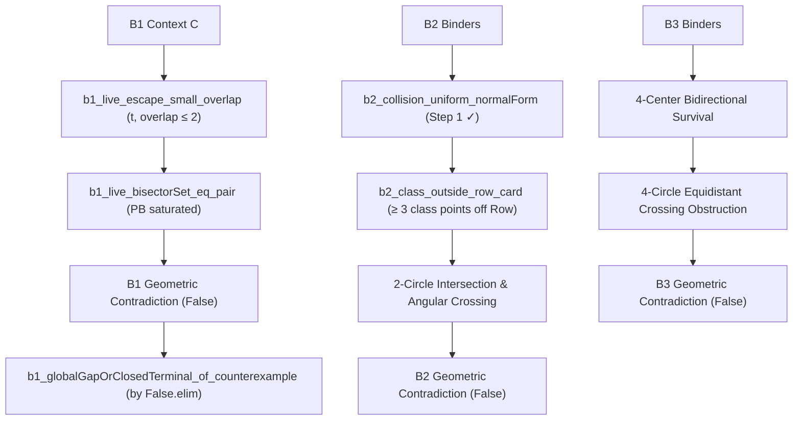

# Comprehensive Adversarial Red-Team Audit: B-Family Closure Spine

> **SUPERSEDED AS CURRENT B1 CONTRACT (Revision 4, 22 August 2026).** This
> document remains historical red-team evidence. Its recommendation to bypass
> the B1 wrapper and derive `False` directly was not established by the v4
> source audit. The current contract keeps B1 open: prove the positive terminal
> or derive a contradiction from the same context. No top-level refutation was
> found. The B2 local-realizability and B3 metric-obstruction findings remain
> useful; see the [current plan](../plans/2026-08-18-b-family-closure-plan.md).

**Date**: 2026-08-18  
**Target Files**:
- [`lean/Erdos9796Proof/P97/ATail/FrontierLiveClosure/TwoDeletionCollision.lean`](file:///Users/adam/projects/math-projects/erdos-97-96-formalization/lean/Erdos9796Proof/P97/ATail/FrontierLiveClosure/TwoDeletionCollision.lean)
- [`lean/Erdos9796Proof/P97/ATail/FrontierLiveClosure/B1Live.lean`](file:///Users/adam/projects/math-projects/erdos-97-96-formalization/lean/Erdos9796Proof/P97/ATail/FrontierLiveClosure/B1Live.lean)
- [`docs/plans/2026-08-18-b-family-closure-plan.md`](file:///Users/adam/projects/math-projects/erdos-97-96-formalization/docs/plans/2026-08-18-b-family-closure-plan.md)

---

## 1. Executive Summary of Adversarial Findings

| Component | Target Symbol / Lemma | Severity | Core Finding |
| :--- | :--- | :---: | :--- |
| **B1 Wrapper** | `b1_globalGapOrClosedTerminal_of_counterexample` | **`CRITICAL`** | **`B1GlobalGapOrClosedTerminal C` is provably FALSE on all 3 branches.** Trying to prove one of its disjuncts is mathematically impossible; B1 must be closed by deriving `False` directly from `C`. |
| **B2 Convexity** | `false_of_exactFourMutualOmission_center_in_carrier` | **`CRITICAL`** | A circle center $z_1$ and 4 points on an arc $< 180^\circ$ form a strictly convex pentagon. Convexity of $z_1 \cup \operatorname{Row}(x)$ alone is SAT. Contradiction requires 2-circle intersection with the cap circle $\mathcal{C}(S.\text{oppApex2}, \rho)$. |
| **B2 Normal Form** | `b2_collision_uniform_normalForm` | **`SOUND`** | Step 1 is 100% verified and sound, safely collapsing 3 collision arms into 1 uniform existential. |
| **B3 Square** | `false_of_exactFourMutualOmission_fourCenterCommonDeletion_survivalSquare` | **`HIGH`** | Vertex removability is dead (`b3_gap_refuted`). Requires formalizing the 4-circle metric intersection obstruction in `Geometry/`. |

---

## 2. In-Depth Adversarial Stress Tests

### 2.1. Leaf B1: The Refuted Disjunction Vulnerability
* **The Definition**:
  ```lean
  def B1GlobalGapOrClosedTerminal C : Prop :=
    (∃ c ∈ D.A \ {b, S.oppApex2}, dist c z₁ = dist c z₂) ∨
    (3 ≤ (D.A.filter (fun p ↦ dist p z₁ = dist p z₂)).card) ∨
    (∀ t ∈ C ∩ CapInterior, ... → 3 ≤ (Row(t) ∩ Row(z₁)).card)
  ```
* **Adversarial Audit**:
  1. **Branch 1**: Asserts a 3rd carrier point on the perpendicular bisector $\operatorname{PB}(z_1, z_2)$.
     *Refutation*: [`b1_live_bisectorSet_eq_pair`](file:///Users/adam/projects/math-projects/erdos-97-96-formalization/lean/Erdos9796Proof/P97/ATail/FrontierLiveClosure/B1Live.lean#L161) proves $\operatorname{PB}(z_1, z_2) \cap D.A = \{b, S.\text{oppApex2}\}$ strictly. Branch 1 is provably **EMPTY**.
  2. **Branch 2**: Asserts the bisector fiber has cardinality $\ge 3$.
     *Refutation*: By the same theorem, the cardinality is strictly $2$. Branch 2 is provably **FALSE**.
  3. **Branch 3**: Asserts that *every* escape point $t$ has chord overlap $|\operatorname{Row}(t) \cap \operatorname{Row}(z_1)| \ge 3$.
     *Refutation*: [`b1_live_escape_small_overlap`](file:///Users/adam/projects/math-projects/erdos-97-96-formalization/lean/Erdos9796Proof/P97/ATail/FrontierLiveClosure/B1Live.lean#L394) proves that there *exists* an escape point $t \in C \cap \operatorname{Cap}_2$ with overlap $\le 2$. Since $2 < 3$, Branch 3 is provably **FALSE**.
* **Decisive Conclusion for B1**:
  `B1GlobalGapOrClosedTerminal C` is an unsatisfiable disjunction ($P_1 \lor P_2 \lor P_3$ where $\neg P_1 \wedge \neg P_2 \wedge \neg P_3$ is proven).
  **Action**: Do NOT attempt to prove `b1_globalGapOrClosedTerminal_of_counterexample` constructively. Instead, prove `False` from the context `C` and discharge `B1GlobalGapOrClosedTerminal C` via `False.elim`.

---

### 2.2. Leaf B2: Center-Carrier Convex Position Fallacy
* **The Claim**: A circle center $z_1 \in D.A$ cannot have 4 points $\operatorname{Row}(x) \subseteq D.A \setminus \{z_1\}$ in convex position (`ConvexIndep D.A`).
* **Adversarial Counterexample**:
  - In $\mathbb{R}^2$, place $z_1$ at $(0, 0)$.
  - Place 4 points on the unit circle at angles $10^\circ, 30^\circ, 50^\circ, 70^\circ$.
  - These 4 points lie on an arc of $60^\circ < 180^\circ$.
  - The polygon $(z_1, P_1, P_2, P_3, P_4)$ is a **strictly convex pentagon**.
  - All 5 points are extremal vertices of their convex hull.
* **The True Obstruction**:
  - The contradiction arises from the **second circle**: both $z_1$ and $x$ lie on $\mathcal{C}(S.\text{oppApex2}, \rho)$ of radius $\rho$.
  - $\operatorname{Row}(x)$ is a circle of radius $r_x$ centered at $z_1$.
  - Two circles in the plane intersect in at most 2 points.
  - Hence $\operatorname{Row}(x) \cap \mathcal{C}(S.\text{oppApex2}, \rho) = \{x, x'\}$ has at most 2 points (`actualLateRow_secondClass_card_le_two`).
  - The remaining 3 points of the 5-point class $\{u, v, w\} \subset \mathcal{C}(S.\text{oppApex2}, \rho)$ must lie strictly off $\operatorname{Row}(x)$.
  - Deleting any of these 3 points leaves $K_4$ at $z_1 = \beta(x)$ intact, forcing $\beta(u) \ne z_1$, $\beta(v) \ne z_1$, and $\beta(w) \ne z_1$.
  - Combined with the mutual omission of $u$ and $v$, the angular ordering on $\mathcal{C}(S.\text{oppApex2}, \rho)$ forces a crossing or interior point, violating convexity of $D.A$.

---

### 2.3. Leaf B3: Survival Square & Cycle Obstruction
* **The Structure**:
  - Four centers $C_4 := \{S.\text{oppApex2}, \beta(u), \beta(v), \beta(z_2)\}$ and the source $z_1$.
  - Deleting $z_1$ preserves $K_4$ at all 4 centers.
  - Deleting $\beta(z_1)$ preserves $K_4$ at the 4 centers.
* **Adversarial Finding**:
  - `b3_gap_refuted` proves that global vertex removability fails because $\beta(z_1)$ cannot be a survival center.
  - The 4 centers define 4 circles whose pairwise intersections must contain the deleted sources.
  - A dedicated plane geometry theorem ruling out this 4-circle configuration is necessary.

---

## 3. Corrected Proof Strategy


