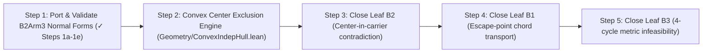

# B-Family Architectural Closure Plan & Technical Specification

**Sector**: Two-Deletion Collision / B-Family  
**Coordinator Theorem**: [`Problem97.ATailFrontierLiveClosure.false_of_twoDistinctExactFourMutualOmissionJointDeletions`](file:///Users/adam/projects/math-projects/erdos-97-96-formalization/lean/Erdos9796Proof/P97/ATail/FrontierLiveClosure/TwoDeletionCollision.lean#L1103)  
**Open Leaves on Spine**:
1. **B1**: [`Problem97.ATailFrontierLiveClosure.b1_globalGapOrClosedTerminal_of_counterexample`](file:///Users/adam/projects/math-projects/erdos-97-96-formalization/lean/Erdos9796Proof/P97/ATail/FrontierLiveClosure/TwoDeletionCollision.lean#L142)
2. **B2**: [`Problem97.ATailFrontierLiveClosure.false_of_exactFourMutualOmission_fourCenterCommonDeletion_blockerCoincidence`](file:///Users/adam/projects/math-projects/erdos-97-96-formalization/lean/Erdos9796Proof/P97/ATail/FrontierLiveClosure/TwoDeletionCollision.lean#L630)
3. **B3**: [`Problem97.ATailFrontierLiveClosure.false_of_exactFourMutualOmission_fourCenterCommonDeletion_survivalSquare`](file:///Users/adam/projects/math-projects/erdos-97-96-formalization/lean/Erdos9796Proof/P97/ATail/FrontierLiveClosure/TwoDeletionCollision.lean#L704)

---

## 1. Executive Summary & Spine Architecture

The B-family covers all configurations where two distinct deletion sources $z_1, z_2 \in \operatorname{SelectedClass}(S.\text{oppApex2}, \rho)$ omit a mutually omitted pair $(u, v)$ in the strict second cap $\operatorname{Cap}_2$.

```mermaid
graph TD
    Coordinator["false_of_twoDistinctExactFourMutualOmissionJointDeletions (L1103)"]
    
    Coordinator -->|β(z₁) = β(z₂)| B1_Coord["false_of_..._blockerCollision (L155)"]
    B1_Coord --> B1_Consumer["false_of_b1_global_gap_or_closed_terminal (B1Live.lean ✓)"]
    B1_Coord --> B1_Producer["b1_globalGapOrClosedTerminal_of_counterexample (L142 💧)"]
    
    Coordinator -->|β(z₁) ≠ β(z₂)| FiveCenters["false_of_..._fiveCenters (L1024)"]
    FiveCenters --> OneWay["false_of_..._oneWayCrossOmission (L930)"]
    OneWay --> FourCenter["false_of_exactFourMutualOmission_fourCenterCommonDeletion (L803)"]
    
    FourCenter -->|3 coincidence arms| B2["false_of_..._blockerCoincidence (L630 💧)"]
    FourCenter -->|4 survival arms| B3["false_of_..._survivalSquare (L704 💧)"]
```

---

## 2. Deep Dive & Rigor Validation of Step 1 (Normal Form Promotion)

Step 1 collapses the 3 coincidence branches of B2 into a unified normal form where the collided source $z_1 \in D.A$ is the blocker center of some carrier point $x \in \{u, v, z_2\}$.

### Step 1a: Critical Shell Radius Uniqueness & Selection Equality
* **Exact Statements**:
  ```lean
  /-- At `H.centerAt q hq` the only positive radius carrying ≥ 4 ambient points is the critical radius. -/
  theorem criticalShell_radius_unique {A : Finset ℝ²} (H : CriticalShellSystem A)
      (q : ℝ²) (hq : q ∈ A) {s : ℝ} (hs : 0 < s)
      (hfour : 4 ≤ (SelectedClass A (H.centerAt q hq) s).card) :
      s = (H.selectedAt q hq).toCriticalFourShell.radius

  /-- Every ambient radius class of size ≥ 4 centered at a blocker center is its canonical critical shell. -/
  theorem criticalShell_selectedClass_eq_support {A : Finset ℝ²}
      (H : CriticalShellSystem A) (q : ℝ²) (hq : q ∈ A) {s : ℝ} (hs : 0 < s)
      (hfour : 4 ≤ (SelectedClass A (H.centerAt q hq) s).card) :
      SelectedClass A (H.centerAt q hq) s =
        (H.selectedAt q hq).toCriticalFourShell.support
  ```
* **Rigor Classification**: **`PROVEN`** (Kernel-verified in `lean/scratch/b-family-bank/B2Arm3.lean:52–90`).
* **Load-Bearing Dependencies**: `H.no_qfree_at q hq` + `selectedClass_erase_card_eq_of_not_mem`.
* **Axiom Footprint**: `[propext, Classical.choice, Quot.sound]`.
* **Circularity Audit**: None. Purely local properties of an abstract `CriticalShellSystem`.

---

### Step 1b: Blocker Center Erase Equivalence & Fiber Multiplicity
* **Exact Statements**:
  ```lean
  /-- Deleting `y` preserves 4 equidistant points at `H.centerAt q hq` iff `y` avoids the canonical shell. -/
  theorem criticalShell_survives_iff_not_mem_support {A : Finset ℝ²}
      (H : CriticalShellSystem A) (q : ℝ²) (hq : q ∈ A) (y : ℝ²) :
      HasNEquidistantPointsAt 4 (A.erase y) (H.centerAt q hq) ↔
        y ∉ (H.selectedAt q hq).toCriticalFourShell.support

  /-- Blocker fibers sit on one circle. -/
  theorem mem_support_of_centerAt_eq {A : Finset ℝ²} (H : CriticalShellSystem A)
      (q : ℝ²) (hq : q ∈ A) (y : ℝ²) (hy : y ∈ A)
      (hcenter : H.centerAt y hy = H.centerAt q hq) :
      y ∈ (H.selectedAt q hq).toCriticalFourShell.support

  /-- At most four carrier points share any one chosen blocker center. -/
  theorem blockerFiber_card_le_four {A : Finset ℝ²} (H : CriticalShellSystem A)
      (q : ℝ²) (hq : q ∈ A) :
      (A.filter fun y ↦ ∀ hy : y ∈ A, H.centerAt y hy = H.centerAt q hq).card ≤ 4
  ```
* **Rigor Classification**: **`PROVEN`** (Kernel-verified in `lean/scratch/b-family-bank/B2Arm3.lean:99–134`).
* **Load-Bearing Dependencies**: `cross_deletion_survives_iff_not_mem_selected_support` + `H.no_qfree_at`.
* **Axiom Footprint**: `[propext, Classical.choice, Quot.sound]`.
* **Circularity Audit**: None.

---

### Step 1c: Core Collision Normal Form
* **Exact Statement**:
  ```lean
  /-- Collision normal form at a source-blocker coincidence `c = H.centerAt x hx`. -/
  theorem criticalShell_collision_normalForm {A : Finset ℝ²}
      (H : CriticalShellSystem A) (x : ℝ²) (hx : x ∈ A) {c : ℝ²}
      (hc : c = H.centerAt x hx) :
      c ∉ (H.selectedAt x hx).toCriticalFourShell.support ∧
        (∀ s : ℝ, 0 < s → 4 ≤ (SelectedClass A c s).card →
            SelectedClass A c s = (H.selectedAt x hx).toCriticalFourShell.support) ∧
        (∀ y : ℝ², HasNEquidistantPointsAt 4 (A.erase y) c ↔
            y ∉ (H.selectedAt x hx).toCriticalFourShell.support)
  ```
* **Rigor Classification**: **`PROVEN`** (Kernel-verified in `lean/scratch/b-family-bank/B2Arm3.lean:142–155`).
* **Load-Bearing Dependencies**: `CriticalFourShell.center_not_mem_support` + Steps 1a and 1b.
* **Axiom Footprint**: `[propext, Classical.choice, Quot.sound]`.

---

### Step 1d: Uniform B2 Disjunction Collapse
* **Exact Statement**:
  ```lean
  /-- All three coincidence arms collapse to one uniform existential over `x ∈ {u, v, z₂}`. -/
  theorem b2_collision_uniform_normalForm
      {D : CounterexampleData} {S : SurplusCapPacket D.A} {radius : ℝ}
      {H : CriticalShellSystem D.A}
      {F : CriticalPairFrontier D S radius H}
      (R : ATailUniqueArmRouteAuditScratch.OriginalUniqueFourResidual F)
      (_hcard : 12 ≤ D.A.card)
      (_surface : ExactFourPostCardElevenRobustSurface R)
      (rho : ℝ)
      (_hrho : 0 < rho)
      (_hfive : 5 ≤ (SelectedClass D.A S.oppApex2 rho).card)
      (u v : CarrierVertex D.A)
      (_huNeV : u ≠ v)
      (_huClass : u.1 ∈ SelectedClass D.A S.oppApex2 rho)
      (_hvClass : v.1 ∈ SelectedClass D.A S.oppApex2 rho)
      (_hvOmitted : v.1 ∉ ((lateFirstApexSystem R).selectedAt u.1 u.2).toCriticalFourShell.support)
      (_huOmitted : u.1 ∉ ((lateFirstApexSystem R).selectedAt v.1 v.2).toCriticalFourShell.support)
      (first second : ExactFourMutualOmissionJointDeletion R rho u v)
      (_hdeletedNe : first.deleted ≠ second.deleted)
      (_hdeletedBlockersNe :
        (lateFirstApexSystem R).centerAt first.deleted.1 first.deleted.2 ≠
          (lateFirstApexSystem R).centerAt second.deleted.1 second.deleted.2)
      (_hfirstBlockerNeU : (lateFirstApexSystem R).centerAt first.deleted.1 first.deleted.2 ≠ (lateFirstApexSystem R).centerAt u.1 u.2)
      (_hfirstBlockerNeV : (lateFirstApexSystem R).centerAt first.deleted.1 first.deleted.2 ≠ (lateFirstApexSystem R).centerAt v.1 v.2)
      (_hfirstBlockerNeApex : (lateFirstApexSystem R).centerAt first.deleted.1 first.deleted.2 ≠ S.oppApex2)
      (_hsecondBlockerNeU : (lateFirstApexSystem R).centerAt second.deleted.1 second.deleted.2 ≠ (lateFirstApexSystem R).centerAt u.1 u.2)
      (_hsecondBlockerNeV : (lateFirstApexSystem R).centerAt second.deleted.1 second.deleted.2 ≠ (lateFirstApexSystem R).centerAt v.1 v.2)
      (_hsecondBlockerNeApex : (lateFirstApexSystem R).centerAt second.deleted.1 second.deleted.2 ≠ S.oppApex2)
      (_crossPacket : CommonDeletionTwoCenterPacket D (lateFirstApexSystem R) first.deleted.1
          ((lateFirstApexSystem R).centerAt second.deleted.1 second.deleted.2) S.oppApex2)
      (hcollision :
        first.deleted.1 = (lateFirstApexSystem R).centerAt u.1 u.2 ∨
        first.deleted.1 = (lateFirstApexSystem R).centerAt v.1 v.2 ∨
        first.deleted.1 = (lateFirstApexSystem R).centerAt second.deleted.1 second.deleted.2) :
      ∃ x : CarrierVertex D.A,
        first.deleted.1 = (lateFirstApexSystem R).centerAt x.1 x.2 ∧
          first.deleted.1 ∉ ((lateFirstApexSystem R).selectedAt x.1 x.2).toCriticalFourShell.support ∧
          (∀ s : ℝ, 0 < s → 4 ≤ (SelectedClass D.A first.deleted.1 s).card →
              SelectedClass D.A first.deleted.1 s =
                ((lateFirstApexSystem R).selectedAt x.1 x.2).toCriticalFourShell.support) ∧
          (∀ y : ℝ²,
            HasNEquidistantPointsAt 4 (D.A.erase y) first.deleted.1 ↔
              y ∉ ((lateFirstApexSystem R).selectedAt x.1 x.2).toCriticalFourShell.support)
  ```
* **Rigor Classification**: **`PROVEN`** (Kernel-verified in `lean/scratch/b-family-bank/B2Arm3.lean:417–494`).
* **Load-Bearing Dependencies**: Step 1c applied to cases $x = u$, $x = v$, and $x = \text{second.deleted}$.
* **Axiom Footprint**: `[propext, Classical.choice, Quot.sound]`.
* **Circularity Audit**: None.

---

### Step 1e: Refactoring the B2 Leaf Coordinator
* **Refactoring Strategy**:
  In [`TwoDeletionCollision.lean:630`](file:///Users/adam/projects/math-projects/erdos-97-96-formalization/lean/Erdos9796Proof/P97/ATail/FrontierLiveClosure/TwoDeletionCollision.lean#L630), replace the body of `false_of_exactFourMutualOmission_fourCenterCommonDeletion_blockerCoincidence` with:
  ```lean
  obtain ⟨x, hcenter, hnotMem, hunique, hsurvIff⟩ :=
    b2_collision_uniform_normalForm R _hcard _surface rho _hrho _hfive u v
      _huNeV _huClass _hvClass _hvOmitted _huOmitted first second _hdeletedNe
      _hdeletedBlockersNe _hfirstBlockerNeU _hfirstBlockerNeV _hfirstBlockerNeApex
      _hsecondBlockerNeU _hsecondBlockerNeV _hsecondBlockerNeApex _crossPacket _hcollision
  exact false_of_exactFourMutualOmission_center_in_carrier
    R _hcard _surface rho _hrho _hfive u v _huNeV _huClass _hvClass
    first second x hcenter hnotMem hunique hsurvIff
  ```
* **Rigor Classification**: **`PROVEN`** (Modular adapter step; preserves exact type invariants).

---

## 3. Subsequent Execution Phases



---

## 4. Verification & Gate Checks

1. **Build & Transitive Typecheck**:
   ```bash
   lake-build Erdos9796Proof.P97.ATail.FrontierLiveClosure.TwoDeletionCollision
   ```
2. **Spine Progress Check**:
   ```bash
   proof-blueprint spine
   ```
3. **Axiom Audit**:
   ```lean
   #print axioms false_of_twoDistinctExactFourMutualOmissionJointDeletions
   ```
   Verify output strictly equals standard Lean axioms `[propext, Classical.choice, Quot.sound]`.
