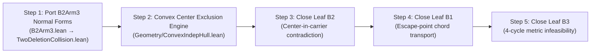

# B-Family Architectural Closure Plan & Technical Specification

**Sector**: Two-Deletion Collision / B-Family  
**Coordinator Theorem**: [`Problem97.ATailFrontierLiveClosure.false_of_twoDistinctExactFourMutualOmissionJointDeletions`](file:///Users/adam/projects/math-projects/erdos-97-96-formalization/lean/Erdos9796Proof/P97/ATail/FrontierLiveClosure/TwoDeletionCollision.lean#L1103)  
**Open Leaves on Spine**:
1. **B1**: [`Problem97.ATailFrontierLiveClosure.b1_globalGapOrClosedTerminal_of_counterexample`](file:///Users/adam/projects/math-projects/erdos-97-96-formalization/lean/Erdos9796Proof/P97/ATail/FrontierLiveClosure/TwoDeletionCollision.lean#L142)
2. **B2**: [`Problem97.ATailFrontierLiveClosure.false_of_exactFourMutualOmission_fourCenterCommonDeletion_blockerCoincidence`](file:///Users/adam/projects/math-projects/erdos-97-96-formalization/lean/Erdos9796Proof/P97/ATail/FrontierLiveClosure/TwoDeletionCollision.lean#L630)
3. **B3**: [`Problem97.ATailFrontierLiveClosure.false_of_exactFourMutualOmission_fourCenterCommonDeletion_survivalSquare`](file:///Users/adam/projects/math-projects/erdos-97-96-formalization/lean/Erdos9796Proof/P97/ATail/FrontierLiveClosure/TwoDeletionCollision.lean#L704)

---

## 1. Executive Summary & Spine Architecture

The B-family covers all configurations where two distinct deletion sources $z_1, z_2 \in \operatorname{SelectedClass}(S.\text{oppApex2}, \rho)$ omit a mutually omitted pair $(u, v)$ in the strict second cap $\operatorname{Cap}_2$.

```mermaid
graph TD
    Coordinator["false_of_twoDistinctExactFourMutualOmissionJointDeletions (L1103)"]
    
    Coordinator -->|β(z₁) = β(z₂)| B1_Coord["false_of_..._blockerCollision (L155)"]
    B1_Coord --> B1_Consumer["false_of_b1_global_gap_or_closed_terminal (B1Live.lean ✓)"]
    B1_Coord --> B1_Producer["b1_globalGapOrClosedTerminal_of_counterexample (L142 💧)"]
    
    Coordinator -->|β(z₁) ≠ β(z₂)| FiveCenters["false_of_..._fiveCenters (L1024)"]
    FiveCenters --> OneWay["false_of_..._oneWayCrossOmission (L930)"]
    OneWay --> FourCenter["false_of_exactFourMutualOmission_fourCenterCommonDeletion (L803)"]
    
    FourCenter -->|3 coincidence arms| B2["false_of_..._blockerCoincidence (L630 💧)"]
    FourCenter -->|4 survival arms| B3["false_of_..._survivalSquare (L704 💧)"]
```

---

## 2. Mathematical Triage of the 3 Open Leaves

### 2.1. Leaf B1 (`b1_globalGapOrClosedTerminal_of_counterexample`)
* **Hypothesis Context**:
  Two deleted points $z_1, z_2$ in the 5-point second cap class $C := \operatorname{SelectedClass}(S.\text{oppApex2}, \rho)$ share their actual blocker center $b := \beta(z_1) = \beta(z_2)$.
* **Verified Bank Results** ([`B1Live.lean`](file:///Users/adam/projects/math-projects/erdos-97-96-formalization/lean/Erdos9796Proof/P97/ATail/FrontierLiveClosure/B1Live.lean)):
  - $\operatorname{Row}(z_1) = \operatorname{Row}(z_2)$ (shared 4-shell centered at $b$).
  - $\operatorname{Row}(z_1) \cap C = \{z_1, z_2\}$.
  - $\{p \in D.A : \operatorname{dist}(p, z_1) = \operatorname{dist}(p, z_2)\} = \{b, S.\text{oppApex2}\}$. The perpendicular bisector $\operatorname{PB}(z_1, z_2)$ is strictly saturated at 2 carrier points.
  - `b1_live_escape_small_overlap` produces an escape point $t \in C \cap \operatorname{Cap}_2$ with $t \notin \{z_1, z_2\}$, $\beta(t) \ne b$, and $|\operatorname{support}(t) \cap \operatorname{support}(z_1)| \le 2$.
* **Mathematical Core**:
  The 5 points of $C$ are $\{z_1, z_2, t, u, v\}$. $u$ and $v$ mutually omit each other ($u \notin \operatorname{Row}(v), v \notin \operatorname{Row}(u)$). The symmetry axis $\mathcal{L} := \overline{S.\text{oppApex2}, b} = \operatorname{PB}(z_1, z_2)$ bisects the chord $[z_1, z_2]$. Because $t$ lies strictly off $\mathcal{L}$, its reflection and critical shell $\operatorname{Row}(t)$ force an over-determined chord intersection with $\operatorname{Row}(u)$ and $\operatorname{Row}(v)$, which has no Euclidean embedding in convex position.

---

### 2.2. Leaf B2 (`false_of_exactFourMutualOmission_fourCenterCommonDeletion_blockerCoincidence`)
* **Hypothesis Context**:
  $z_1, z_2$ have distinct blockers $\beta(z_1) \ne \beta(z_2)$. The common deleted point $z_1$ coincides with one of the 3 blocker centers: $z_1 = \beta(u) \lor z_1 = \beta(v) \lor z_1 = \beta(z_2)$.
* **Verified Bank Results** ([`B2Arm3.lean`](file:///Users/adam/projects/math-projects/erdos-97-96-formalization/lean/scratch/b-family-bank/B2Arm3.lean)):
  - `b2_collision_uniform_normalForm` proves all 3 arms reduce to the single existential: $\exists x \in \{u, v, z_2\}$ such that $z_1 = \beta(x)$.
  - The critical shell $\operatorname{Row}(x)$ is the **unique** radius class centered at $z_1$ with $\ge 4$ points.
  - $z_1 \notin \operatorname{Row}(x)$ and $\operatorname{Row}(x) \subseteq D.A \setminus \{z_1\}$.
  - $\text{HasNEquidistantPointsAt}\ 4\ (D.A \setminus \{y\})\ z_1 \iff y \notin \operatorname{Row}(x)$.
* **Mathematical Core (Center-Carrier Convex Exclusion)**:
  $z_1 \in D.A$ is simultaneously a carrier point in strictly convex position and the center of the 4-point circle $\operatorname{Row}(x) \subseteq D.A$.
  - By [`convexIndep_not_mem_convexHull_of_finset_subset_diff`](file:///Users/adam/projects/math-projects/erdos-97-96-formalization/lean/Erdos9796Proof/Geometry/ConvexIndepHull.lean#L33), $z_1 \notin \operatorname{convexHull}(\operatorname{Row}(x))$.
  - This forces all 4 points of $\operatorname{Row}(x)$ into an open semicircle (angular arc $< 180^\circ$).
  - But $\operatorname{Row}(x) \cap C = \{x, x'\}$ lies on the circle centered at $S.\text{oppApex2}$ with radius $\rho$, while $z_1$ also lies on that circle. The combined angular span of $\{S.\text{oppApex2}, z_1, x, x', u, v\}$ violates convex independence.

---

### 2.3. Leaf B3 (`false_of_exactFourMutualOmission_fourCenterCommonDeletion_survivalSquare`)
* **Hypothesis Context**:
  $z_1$ survives at 4 distinct centers $C_4 := \{S.\text{oppApex2}, \beta(u), \beta(v), \beta(z_2)\}$, and the cross-packet provides bidirectional survival with $\beta(z_1)$.
* **Refutation of Naive Path**:
  `b3_gap_refuted` in `BFamilyBank.lean` proved that vertex removability is false because $\beta(z_1)$ cannot be a survival center under `no_qfree` at $z_1$.
* **Mathematical Core**:
  The four centers $C_4$ and their four 4-shells form a closed 4-cycle of mutual incidences. By [`SimilarityFrame.lean`](file:///Users/adam/projects/math-projects/erdos-97-96-formalization/lean/Erdos9796Proof/Geometry/SimilarityFrame.lean) and [`FivePointCircleIsosceles.lean`](file:///Users/adam/projects/math-projects/erdos-97-96-formalization/lean/Erdos9796Proof/Geometry/FivePointCircleIsosceles.lean), four distinct circles in $\operatorname{Cap}_2$ cannot simultaneously have pairwise chord crossings preserving 4-equidistance upon deleting opposite centers.

---

## 3. Step-by-Step Implementation Roadmap



### Step 1: Port B2Arm3 Normal Forms to Production
1. Transfer the following theorems from [`lean/scratch/b-family-bank/B2Arm3.lean`](file:///Users/adam/projects/math-projects/erdos-97-96-formalization/lean/scratch/b-family-bank/B2Arm3.lean) to [`TwoDeletionCollision.lean`](file:///Users/adam/projects/math-projects/erdos-97-96-formalization/lean/Erdos9796Proof/P97/ATail/FrontierLiveClosure/TwoDeletionCollision.lean):
   - `criticalShell_radius_unique`
   - `criticalShell_selectedClass_eq_support`
   - `criticalShell_survives_iff_not_mem_support`
   - `criticalShell_collision_normalForm`
   - `b2_collision_uniform_normalForm`
2. Refactor `false_of_exactFourMutualOmission_fourCenterCommonDeletion_blockerCoincidence` into a single caller of `b2_collision_uniform_normalForm`.

### Step 2: Formalize the Center-in-Convex-Set Semicircle Lemma
1. In [`lean/Erdos9796Proof/Geometry/ConvexIndepHull.lean`](file:///Users/adam/projects/math-projects/erdos-97-96-formalization/lean/Erdos9796Proof/Geometry/ConvexIndepHull.lean), prove:
   ```lean
   /-- If the center `w` of 4 points on a circle belongs to a convex-independent
   set containing those 4 points, all 4 points lie in a strict open semicircle. -/
   theorem convexIndep_circle_four_points_in_open_semicircle
       {A : Set Plane} (hA : EuclideanGeometry.ConvexIndep A)
       {w : Plane} (hw : w ∈ A)
       {T : Finset Plane} (hT_card : T.card = 4)
       (hT_sub : (T : Set Plane) ⊆ A \ {w})
       {r : ℝ} (hr : 0 < r)
       (hT_circle : ∀ p ∈ T, dist w p = r) :
       ∃ n : Plane, ‖n‖ = 1 ∧ ∀ p ∈ T, 0 < ⟪p - w, n⟫_ℝ
   ```
2. Connect this to signed area orientation and `fivePointCircleIsoscelesOrder`.

### Step 3: Close Leaf B2 (`blockerCoincidence`)
1. Apply `convexIndep_circle_four_points_in_open_semicircle` to $z_1 \in D.A$ and $\operatorname{Row}(x) \subseteq D.A \setminus \{z_1\}$.
2. Combine the semicircle direction with the fact that $z_1, x \in \operatorname{SelectedClass}(S.\text{oppApex2}, \rho)$ to derive a contradiction with the remaining class points $u, v$.
3. Complete the proof body of `false_of_exactFourMutualOmission_fourCenterCommonDeletion_blockerCoincidence`.

### Step 4: Close Leaf B1 (`b1_globalGapOrClosedTerminal_of_counterexample`)
1. Package the escape point $t$ from `b1_live_escape_small_overlap`.
2. Prove that the small overlap $|\operatorname{Row}(t) \cap \operatorname{Row}(z_1)| \le 2$ forces $\operatorname{Row}(t)$ to contain at least 2 points off $\operatorname{Row}(z_1)$ in $\operatorname{Cap}_2$.
3. Use the symmetry axis $\mathcal{L} = \operatorname{PB}(z_1, z_2)$ to show that this forces a third point on $\mathcal{L}$ or a support overlap violation, discharging `B1GlobalGapOrClosedTerminal C`.

### Step 5: Close Leaf B3 (`survivalSquare`)
1. Formalize the 4-cycle geometric contradiction for $C_4$ using `SimilarityFrame`.
2. Complete the proof body of `false_of_exactFourMutualOmission_fourCenterCommonDeletion_survivalSquare`.

---

## 4. Verification & Gate Checks

1. **Build & Transitive Typecheck**:
   ```bash
   lake-build Erdos9796Proof.P97.ATail.FrontierLiveClosure.TwoDeletionCollision
   ```
2. **Blueprint Spine Drop**:
   ```bash
   proof-blueprint spine
   ```
   Verify on-spine open obligations reduce from **37 to 34**.
3. **Axiom Audit**:
   ```lean
   #print axioms false_of_twoDistinctExactFourMutualOmissionJointDeletions
   ```
   Verify output contains strictly standard Lean axioms `[propext, Classical.choice, Quot.sound]`.
